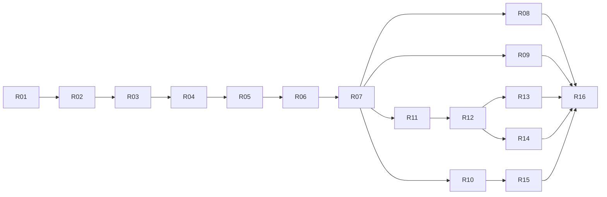

# Requirements: Stadtfest-Finder Schritt für Schritt

Dieser Ordner beschreibt, **in welcher Reihenfolge** der Stadtfest-Finder gebaut wird und **was je Schritt fertig sein muss**. Grundlage sind:

- das nutzerorientierte Design in [`../15-design/`](../15-design/README.md) (Workflows, Screens, Prototyp),
- die daraus abgeleitete Systemarchitektur [`../20-architecture/00-Design.pdf`](../20-architecture/00-Design.pdf),
- die verbindlichen Regeln in [`/CLAUDE.md`](../../CLAUDE.md).

Wo Design und Architektur sich widersprechen, gilt die Architektur bzw. CLAUDE.md. Die Abweichungen sind unten unter [Entscheidungen](#entscheidungen) festgehalten.

## Prinzip

Jedes Inkrement ist ein **vertikaler Schnitt**: API-Spec → Backend (Domain, Use Case, Adapter) → Mobile → Tests → Doku. Nach jedem Inkrement läuft `make check` grün und die App ist lauffähig. Jedes Inkrement geht als eigener Feature-Branch per PR (auch mehrere PRs je Inkrement sind in Ordnung).

## Reihenfolge

| Nr. | Inkrement | Workflows | Hängt ab von | Ergebnis |
|---|---|---|---|---|
| R01 | [Fundament](R01-fundament.md) | – | – | Repo, lokaler Stack, Skeletons, CI, Codegen, Theme |
| R02 | [Katalog-Backend](R02-katalog-backend.md) | 01, 02 (Backend) | R01 | Datenmodell Feste/Kategorien/Regionen/PLZ, öffentliche Lese-API, Geocoding, Cache, Seed |
| R03 | [Entdecken: Karte, Liste, Suche, Filter](R03-entdecken.md) | 01 | R02 | Gäste finden Feste auf Karte und Liste |
| R04 | [Fest-Details](R04-fest-details.md) | 02, 03 (Gast-Hinweis) | R03 | Detailseite, Route, Website, Deep Link, Gast-Hinweis |
| R05 | [Authentifizierung und Konto](R05-authentifizierung.md) | 03 | R04 | Login via IdP, `/me`, Rollen, Logout, Konto löschen |
| R06 | [Favoriten und Zeitleiste](R06-favoriten-zeitleiste.md) | 04 | R05 | Herz, Profil-Drawer mit Festsaison, Theme-Umschalter |
| R07 | [Moderation: Feste](R07-moderation-feste.md) | 08 | R06 | Moderationsansicht, Feste pflegen, Statusmodell, Domain-Events |
| R08 | [Moderation: Bilder](R08-moderation-bilder.md) | 08 | R07 | Upload, Thumbnails, Galerie |
| R09 | [Moderation: Kategorien](R09-moderation-kategorien.md) | 10 | R07 | Kategorien pflegen (Rolle `category_admin`) |
| R10 | [KI-Suche per PLZ](R10-ki-suche.md) | 09 | R07 | Async-Job, LLM-Port, Web-Suche, Entwürfe, Prüfmodus |
| R11 | [Benachrichtigungen und Push](R11-benachrichtigungen.md) | 07 | R07 | Benachrichtigungsliste, Einstellungen, Push-Port, Erinnerungen |
| R12 | [Freunde](R12-freunde.md) | – (neu) | R11 | Freundschaft per Link/QR |
| R13 | [Gemeinsame Listen](R13-gemeinsame-listen.md) | 05 | R12 | Listen mit Freunden |
| R14 | [Einladungen](R14-einladungen.md) | 06 | R12 | Einladen, Zu-/Absage, Erinnern, Einladungslink |
| R15 | [MCP-Server](R15-mcp-server.md) | Flow D | R10 | FastMCP mit `search_events`, `get_event`, `start_ai_search` |
| R16 | [Deployment und Release](R16-deployment-release.md) | – | alle | Produktion auf Komodo, Zitadel Cloud, EAS, Store-Release |

R08, R09 und R10 sind nach R07 voneinander unabhängig und können parallel laufen. Dasselbe gilt für R13 und R14 nach R12.

> **Empfehlung:** Einen Teil von R16 (Produktionsstack auf Komodo, Zitadel Cloud) nach R05 vorziehen. So läuft ab dann jeder Merge auf `main` gegen eine echte Umgebung.

## Entscheidungen

Diese Entscheidungen wurden beim Ableiten der Requirements getroffen (Rückfrage an den Product Owner, 28.09.2026). Sie gehen dem Design vor.

| ID | Thema | Entscheidung | Abweichung vom Design |
|---|---|---|---|
| E-01 | Login | **Zitadel Hosted Login** über OIDC Authorization Code + PKCE, lokal Keycloak. Apple und Google sind als IdP in Zitadel angebunden. Die Buttons „Mit Apple/Google fortfahren“ öffnen den Hosted Login mit IdP-Hinweis. | Die Endpunkte `/auth/*` entfallen. Screens 03-04 bis 03-06 werden zum Einstieg-Screen ohne eigene Formularfelder. Passwort vergessen, E-Mail-Validierung und Registrierung laufen auf der IdP-Seite. |
| E-02 | Freunde | Freundschaft entsteht über einen **persönlichen Freundschaftslink bzw. QR-Code**. Es gibt keine Suche nach E-Mail oder Namen. | Das Feature ist neu, im Design nicht gestaltet ([R12](R12-freunde.md)). |
| E-03 | Zeitraumfilter | **Monatsraster wie im Prototyp**: Alle Termine, Heute, Dieses Wochenende, Monate mit Mehrfachauswahl. | Kein freier Kalender. |
| E-04 | Push-Inhalt | Der Push enthält einen **generischen Titel und Text je Art ohne Namen oder Festdetails** plus IDs. Den vollen Text zeigt die Benachrichtigungsliste. | Design-Beispiele wie „Jonas Weber lädt dich ein“ gibt es nur in der Liste, nicht im Push. |
| E-05 | Region | Eine Region ist eine **Menge von Postleitzahlen**. Ein Fest gehört zur Region, wenn seine PLZ (aus der Adresse bzw. per Reverse-Geocoding des Pins) in dieser Menge liegt. Es gibt keine eigenen Geometrien. Die Pflege läuft per Migration/Seed, eine UI gibt es nicht. | Konkretisiert „Polygon oder postalCodes[]“. |
| E-06 | Kategorien-Rechte | Eigene Rolle **`category_admin`**. Moderatoren ohne diese Rolle sehen den Tab „Kategorien“ nur lesend. Umgesetzt in R09. | Im Prototyp darf jeder Moderator Kategorien ändern. |
| E-07 | Rollenvergabe | Rollen `moderator` und `category_admin` werden in **Zitadel** vergeben. Die **Region** hinterlegt ein Admin als Nutzer-Metadatum, das als Claim im Token erscheint. Dazu gibt es ein Runbook in `40-operations`. | Im Design offen. |
| E-08 | Personenbezogene Daten im Backend | Das Backend speichert je Nutzer nur `id` (= IdP-`sub`), `firstName` und `lastName` (für Freunde, Listen, Einladungen). **Keine E-Mail, kein Passwort.** Die E-Mail im Drawer kommt aus dem ID-Token. | Das Design-Datenmodell hat `email`, `authProviders`. |
| E-09 | Benachrichtigungstexte | Benachrichtigungen werden **strukturiert** gespeichert (Art + IDs). Der Anzeigetext entsteht beim Lesen. So verschwinden Namen gelöschter Accounts automatisch. | Im Design ist `text` fertig formuliert gespeichert. |
| E-10 | Wohnort | Gespeichert werden **PLZ, Ortsname und PLZ-Mittelpunkt**, keine exakte GPS-Position. „Aktuellen Standort verwenden“ löst die Position per Reverse-Geocoding auf, danach wird die GPS-Position verworfen. | Das Design speichert `homeLat/homeLon` exakt. |
| E-11 | Geocoding | **Selbst gehostetes Nominatim** (Container im eigenen Stack, OSM-Extrakt Deutschland von Geofabrik) für alles: PLZ-/Ortssuche mit Autocomplete, Straßenadressen, Reverse-Geocoding. Es gibt **keine eigene PLZ-Tabelle**. Die App ruft Nominatim nie direkt auf, sondern immer über `/v1/geocode*` des Backends (Geocoding-Port, Redis-Cache 30 Tage). Nutzerpositionen verlassen so nie die eigene Infrastruktur. Lokal und in CI: Fake-Adapter bzw. aufgezeichnete Fixtures, optional ein kleiner Nominatim-Container mit einem Regionsextrakt (z. B. Baden-Württemberg). | – |
| E-12 | KI-Job-Abschluss | **Polling alle 10 s** plus Push an den Moderator (ab R11). **Kein SSE.** | Das Design nennt SSE als Option. |
| E-13 | Domain-Events | **Transactional Outbox** in PostgreSQL, ein Relay reiht die Events in arq ein. | Das Design spricht allgemein von einer „Job-Queue“. |
| E-14 | Suchindex | Es gibt **keinen separaten Suchindex**. Gesucht wird über PostGIS und `pg_trgm`, gecacht in Redis. | Das Design spricht von „Suchindex aktualisieren“; das bedeutet hier Cache-Invalidierung. |
| E-15 | Clustering | **Clientseitig** mit MapLibre-Clustering (Radius 46 px). Das Backend liefert höchstens 500 Feste pro Ausschnitt. | Offener Punkt aus 01 entschieden. |
| E-16 | Konto löschen | Wird in R05 ergänzt (App-Store-Pflicht, Art. 17 DSGVO). | Im Design nicht gestaltet. |

Übernommene **Annahmen aus dem Design** gelten als Anforderung, sofern ein Inkrement nichts anderes sagt. Beispiele: Offline nur lesend, `404` für Feste fremder Regionen, Absage-Benachrichtigung auch an Zugesagte, `409` bei Versionskonflikt.

## Querschnittsregeln für alle Inkremente

1. **API-first:** Jede Schnittstelle entsteht zuerst in `api/openapi.yaml`, danach folgt `make gen`. Pfade beginnen mit `/v1`, JSON-Felder sind camelCase, Zeiten sind ISO 8601, Zeitzone für „heute“ ist `Europe/Berlin`.
2. **Fehlerformat** wie in [api-endpunkte.md](../15-design/backend/api-endpunkte.md#fehlerformat): `{error, message, fields?}` mit den dort genannten Statuscodes.
3. **Autorisierung in Use Cases**, nicht in Routern. REST, MCP und Worker nutzen dieselben Use Cases.
4. **Texte:** Die UI-Texte und Toasts sind deutsch und kommen **wörtlich aus Design bzw. Prototyp**. Sie liegen zentral in einer String-Datei, nicht verstreut im Code.
5. **Komponenten:** Jede gemeinsame Komponente hat eine Storybook-Story mit den Zuständen default, loading, empty, error und disabled, soweit sinnvoll. Jedes interaktive Element hat eine `testID` nach dem Schema `<bereich>.<element>[.<id>]`, z. B. `discover.search.input`.
6. **Dunkel/Hell:** Jeder neue Screen funktioniert in beiden Modi. Die Farben kommen ausschließlich aus den Theme-Tokens.
7. **Datenschutz:** Jedes Inkrement, das personenbezogene Daten speichert, **erweitert den Use Case „Konto löschen“** (R05) und das Verzeichnis der Verarbeitungstätigkeiten (VVT) im selben PR und legt die Aufbewahrungsfrist fest. Personenbezogene Daten dürfen nicht geloggt werden, auch keine Koordinaten der Nutzer und keine Query-Strings mit `lat/lon`.
8. **Externe Dienste:** Jede neue Abhängigkeit bekommt im selben PR eine Anleitung in `00-docs/40-operations/`, ein ADR bei Architekturwirkung oder Nicht-EU-Verarbeitern und einen Eintrag in `.env.example`.
9. **Neue Bibliotheken** werden vor der Einführung kurz abgestimmt (CLAUDE.md „When unsure“). Die Inkremente nennen Vorschläge, das ist keine Freigabe.
10. **Definition of Done** jedes Inkrements = DoD aus CLAUDE.md + die inkrementspezifischen Punkte.

## Aufbau der Inkrement-Dateien

Steckbrief · Umfang (drin / nicht drin) · User Stories mit Akzeptanzkriterien · API · Daten · Backend · Mobile · Datenschutz · Tests · Doku/Betrieb · Definition of Done · offene Punkte.

Story-IDs: `R03-US2` = Inkrement R03, Story 2. Screen-IDs (z. B. `01-05`) verweisen auf [`../15-design/screenshots/`](../15-design/00-ueberblick/screen-inventar.md).

## Offene Punkte (nicht blockierend, Entscheidung spätestens im genannten Inkrement)

| Thema | Spätestens | Vorschlag |
|---|---|---|
| Kartenkacheln (EU-gehostete OSM-Vektorkacheln, Dunkel-/Hellstil) | R03 | Selbst gehostete Protomaps-PMTiles im Objektspeicher oder MapTiler (CH). Entscheidung per ADR. |
| Codegen-Werkzeuge (Backend-Modelle, Mobile-Client + TanStack-Hooks) | R01 | `datamodel-code-generator` fürs Backend, Orval für Mobile |
| Deep-Link-Domain `stadtfest-finder.de` (Universal Links / App Links, Fallback-Seite ohne App) | R04 | Statische Seite mit AASA/assetlinks und Store-Links, per Komodo ausgeliefert |
| LiteLLM oder Pydantic AI als generischer LLM-Adapter | R10 | ADR |
| Web-Such-Anbieter | R10 | ADR, EU-Anbieter bevorzugt |
| Kosten- und Rate-Limit der KI-Suche | R10 | 10 Jobs pro Moderator und Tag, konfigurierbar per ENV |
| Dynamic Client Registration für MCP-Clients bei Zitadel | R15 | prüfen; sonst statische Client-ID je Client |
| Muss die E-Mail vor Account-Aktionen bestätigt sein? | R05 | Nein, E-Mail-Bestätigung per Zitadel-Einstellung erzwingbar |
| Architektur als Markdown (`00-docs/20-architecture/system-architecture.md`, von CLAUDE.md referenziert, fehlt noch) | R01 | Aus dem PDF ableiten (Mermaid C4) |
