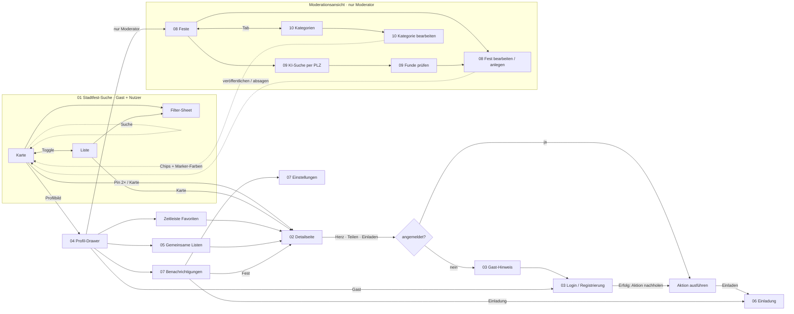
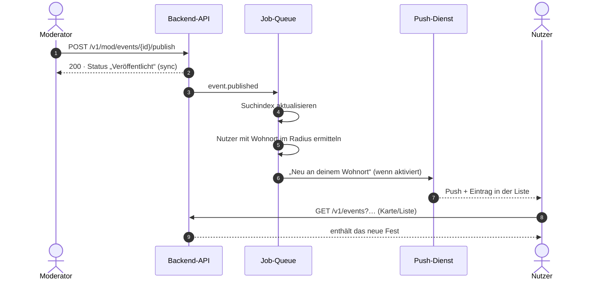

# Gesamtworkflow

Die App startet ohne Anmeldung auf der Karte. Alles, was Entdecken betrifft, funktioniert als Gast. Funktionen mit Account (Favorit, Teilen, Einladen) zeigen Gästen einen Hinweis, blockieren sie aber nicht. Der Profil-Drawer ist der zentrale Einstieg in alle persönlichen Bereiche und, für Moderatoren, in die Moderationsansicht.

## Navigationskarte

Durchgezogene Pfeile sind Navigation. Gestrichelte Pfeile zeigen, wo Moderationsaktionen die Nutzeransicht verändern.

## Teil-Workflows im Zusammenhang

| Nr. | Workflow | Einstieg | Führt weiter zu |
|---|---|---|---|
| 01 | [Stadtfest-Suche](../workflows/01-stadtfest-suche.md) | App-Start | 02, 04 |
| 02 | [Fest-Details](../workflows/02-fest-details.md) | 01, 04, 05, 07 | 03 (Gast), 06, externe Karten-App |
| 03 | [Authentifizierung](../workflows/03-authentifizierung.md) | 02 (Account-Aktion), 04 (Gast-Drawer) | zurück zur ausgelösten Aktion |
| 04 | [Favoriten und Zeitleiste](../workflows/04-favoriten-und-zeitleiste.md) | Profilbild | 02, 05, 07, 08 |
| 05 | [Gemeinsame Listen](../workflows/05-gemeinsame-listen.md) | 04 | 02 |
| 06 | [Einladungen](../workflows/06-einladungen.md) | 02, 07 | 02 |
| 07 | [Benachrichtigungen](../workflows/07-benachrichtigungen.md) | 04, Push | 02, 06 |
| 08 | [Moderation: Feste](../workflows/08-moderation-feste.md) | 04 → „Moderator-Ansicht“ | 09, 10; wirkt auf 01, 02, 07 |
| 09 | [Moderation: KI-Suche](../workflows/09-moderation-ki-suche.md) | 08 → „Suchen“ | 08 |
| 10 | [Moderation: Kategorien](../workflows/10-moderation-kategorien.md) | 08 → Tab „Kategorien“ | wirkt auf 01 |

## Wie Moderation und Nutzeransicht zusammenhängen

Absagen läuft genauso ab (`event.cancelled` → alle Nutzer mit diesem Favoriten). Für Kategorien siehe [10](../workflows/10-moderation-kategorien.md).

## Globale Verhaltensregeln

- **Such- und Filterzustand** bleibt beim Wechsel zwischen Karte und Liste erhalten und gilt für beide Ansichten.
- **Unterseiten** liegen als Stapel übereinander, „Zurück“ schließt nur die oberste.
- **Toasts** bestätigen jede Aktion und verschwinden nach 2,2 s.
- **Dunkelmodus** ist Standard. Die echte App soll der Systemeinstellung folgen, im Drawer lässt sich das überschreiben (lokal gespeichert).
- **Deep Links:** `https://stadtfest-finder.de/f/{eventId}` öffnet die Detailseite, `…/einladung/{id}` die erhaltene Einladung.
- **Offline:** Die zuletzt geladenen Feste bleiben lesbar. Schreibaktionen zeigen den Hinweis „Keine Verbindung“ und werden nicht in eine Warteschlange gestellt (Annahme).
