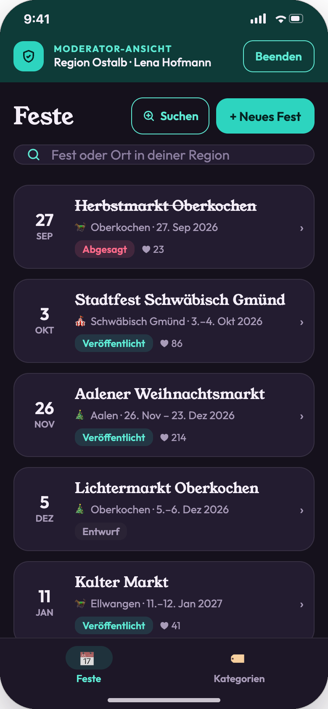

# Rollen und Rechte

Es gibt drei Rollen. Moderatoren melden sich mit demselben Account an wie normale Nutzer. Die Rolle ist eine Eigenschaft des Accounts (`roles: ["user","moderator"]`) und wird zusätzlich einer **Region** zugeordnet.

| Funktion | Gast | Nutzer | Moderator |
|---|---|---|---|
| Karte, Liste, Suche, Filter | ✓ | ✓ | ✓ |
| Detailseite, Route starten, Website öffnen | ✓ | ✓ | ✓ |
| Favorit markieren | Hinweis → Login | ✓ | ✓ |
| Fest teilen | Hinweis → Login | ✓ | ✓ |
| Freunde einladen, zu-/absagen | Hinweis → Login | ✓ | ✓ |
| Gemeinsame Listen | – | ✓ | ✓ |
| Benachrichtigungen und Einstellungen | – | ✓ | ✓ |
| Profil-Drawer mit Zeitleiste | Anmelde-Hinweis | ✓ | ✓ |
| Link „Moderator-Ansicht“ im Drawer | – | – | ✓ |
| Feste anlegen, bearbeiten, veröffentlichen, absagen, löschen | – | – | ✓ nur eigene Region |
| KI-Suche per PLZ auslösen | – | – | ✓ (Ergebnisse landen in der eigenen Region) |
| Kategorien anlegen, bearbeiten, sortieren, deaktivieren, löschen | – | – | ✓ app-weit |
| Nutzer verwalten | – | – | – (ausdrücklich nicht vorgesehen) |

## Durchsetzung

- Das **Frontend** blendet Moderationsfunktionen nur ein, wenn `GET /v1/me` die Rolle `moderator` liefert.
- Das **Backend** prüft jede Anfrage unter `/v1/mod/*` selbst: Rolle vorhanden und, bei Festen, `event.regionId == user.regionId`. Verstöße ergeben `403`, Feste anderer Regionen `404` (keine Auskunft, dass sie existieren).
- Gast-Aufrufe an geschützte Endpunkte ergeben `401`. Der Client zeigt daraufhin den Gast-Hinweis ([03](../workflows/03-authentifizierung.md)).

## Screenshots

| Nutzer (ohne Moderator-Link) | Moderator (mit Moderator-Link) | Moderationsansicht |
|---|---|---|
|  |  |  |

## Offene Punkte

- Darf jeder Moderator Kategorien ändern, oder nur eine eigene Rolle „Kategorie-Admin“? Der Prototyp erlaubt es jedem Moderator.
- Wer vergibt die Moderator-Rolle und die Region? Im Prototyp nicht vorgesehen (Backoffice oder direkt in der Datenbank).
