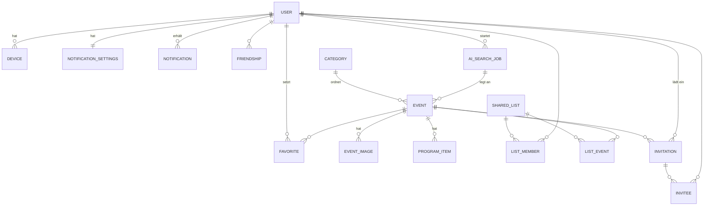

# Datenmodell

## Entitäten

Regionen gibt es seit dem 05.10.2026 nicht mehr ([ADR 0015](../../25-adr/0015-regionen-abgeschafft.md)).

### User
| Feld | Typ | Hinweis |
|---|---|---|
| id | uuid | |
| firstName, lastName | string | |
| email | string, unique | |
| authProviders | enum[] `apple, google, password` | |
| roles | enum[] `user, moderator` | |
| createdAt | datetime | |

### Event
| Feld | Typ | Hinweis |
|---|---|---|
| id | uuid | |
| name, shortName | string | shortName für die Pin-Pille |
| categoryId | uuid? | Pflicht beim Veröffentlichen |
| status | enum `draft, published, cancelled` | „Vergangen“ wird aus `endDate < heute` abgeleitet |
| startDate, endDate | date | |
| openingHours | string[] | Freitext-Zeilen |
| price | string | Freitext, z. B. „Frei · Fahrgeschäfte kostenpflichtig“ |
| place, address, city, postalCode | string | |
| lat, lon | number | Pflicht beim Veröffentlichen |
| description | text | |
| transit, parking | string | Anfahrt |
| websiteUrl | url | |
| cancelReason | string? | bei Absage |
| source | enum `manual, ai` | |
| sourceUrl, aiJobId | string?, uuid? | nur bei KI-Funden |
| favoriteCount | int | denormalisiert |
| version | int | optimistische Sperre |
| createdBy, updatedBy, publishedAt, deletedAt | | Audit, Soft-Delete |

### EventImage
`id`, `eventId`, `url`, `thumbUrl`, `position` (0 = Titelbild), `width`, `height`.

### ProgramItem
`id`, `eventId`, `date` (date), `timeLabel` (z. B. „10:45 Uhr“), `title`, `subtitle`, `position`.

### Category
`id`, `name`, `emoji`, `color` (Hex aus der Palette), `active` (bool), `sortOrder` (int).

### Favorite
`userId`, `eventId`, `createdAt` — Primärschlüssel `(userId, eventId)`.

### SharedList · ListMember · ListEvent
- `SharedList`: `id`, `name`, `createdBy`, `createdAt`
- `ListMember`: `listId`, `userId`, `addedBy`, `addedAt`
- `ListEvent`: `listId`, `eventId`, `addedBy`, `addedAt`

### Friendship
`userId`, `friendId`, `createdAt` (symmetrisch gespeichert).

### Invitation · Invitee
- `Invitation`: `id`, `eventId`, `hostId`, `message`, `createdAt`, `lastReminderAt` — eindeutig `(eventId, hostId)`
- `Invitee`: `invitationId`, `userId`, `status` enum `open, accepted, declined`, `respondedAt`

### Notification
| Feld | Typ | Hinweis |
|---|---|---|
| id | uuid | |
| userId | uuid | |
| type | enum `remind, near, change, cancel, invite, rsvp_yes, rsvp_no, list_added` | |
| text | string | fertig formulierter Anzeigetext |
| target | `{type: event\|invitation\|invitationOverview, id}` | Deep-Link-Ziel |
| read | bool | |
| pushed | bool | wurde ein Push verschickt |
| createdAt | datetime | |

### NotificationSettings
`userId`, `remind` (bool), `remindDaysBefore` (1 \| 3 \| 7), `near` (bool), `homeName`, `homePostalCode`, `homeLat`, `homeLon`, `nearRadiusKm` (5–150), `change`, `invite`, `rsvp` (bool).

### Device
`userId`, `pushToken`, `platform` (`ios`, `android`), `lastSeenAt`.

### AiSearchJob
`id`, `moderatorId`, `postalCode`, `status` (`queued, running, completed, failed`), `startedAt`, `finishedAt`, `newEventIds[]`, `skippedDuplicate`, `skippedOutOfArea`, `error`, `log` (Quellen, Anfragen).
