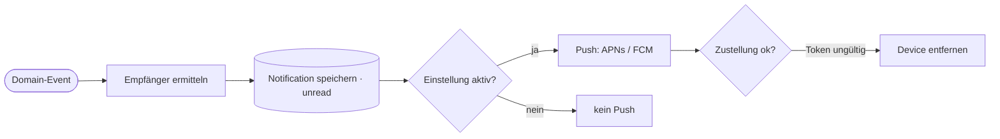

# Ereignisse und Hintergrundjobs

Alles, was nicht unmittelbar für die Antwort an den Aufrufer nötig ist, läuft **asynchron** über eine Job-Queue: Benachrichtigungen, Index, Bilder, KI-Suche. Die API antwortet, sobald der Hauptdatensatz gespeichert ist.

## Domain-Events

| Event | Ausgelöst durch | Konsumenten | Folge |
|---|---|---|---|
| `event.published` | `POST /mod/events/{id}/publish` (08, 09) | Suchindex, Near-Home-Matcher | Fest in Karte und Liste sichtbar. Benachrichtigung „Neu an deinem Wohnort“ an Nutzer mit `near = true` und `distance(home, event) ≤ nearRadiusKm`. |
| `event.updated` | `PATCH /mod/events/{id}` bei veröffentlichtem Fest | Suchindex, Change-Notifier | Bei Änderung von `startDate`, `endDate`, `openingHours`, `address`, `lat/lon`: „Änderung“ an alle mit diesem Favoriten (`change = true`), zusammengefasst pro Fest und Stunde. |
| `event.unpublished` | „Als Entwurf“ bei veröffentlichtem Fest | Suchindex | Aus Karte und Liste entfernt, keine Benachrichtigung. |
| `event.cancelled` | `POST /mod/events/{id}/cancel` | Suchindex, Cancel-Notifier | Benachrichtigung „Fest abgesagt“ (mit Grund) an alle mit diesem Favoriten und alle Zugesagten. |
| `event.deleted` | `DELETE /mod/events/{id}` | Cleanup | Favoriten, Listeneinträge, Einladungen und Bilder werden entfernt. Keine Benachrichtigung. |
| `category.changed` | POST/PATCH/order/DELETE Kategorien (10) | Cache, Suchindex | `GET /categories` wird invalidiert. Beim Löschen werden die Feste auf die Ersatzkategorie umgehängt und neu indiziert. |
| `invitation.created` | `POST /events/{id}/invitation/invitees` (06) | Notifier | „Einladung“ an jeden neuen Eingeladenen (`invite`). |
| `invitation.reminded` | `POST /invitations/{id}/reminders` | Notifier | Erinnerung an alle mit Status `open`. |
| `invitation.responded` | `PUT /invitations/{id}/response` | Notifier, Favoriten | Zusage: Favorit setzen. „Zusage“ bzw. „Absage“ an den Einladenden (`rsvp`). |
| `list.member_added` | `POST /lists`, `POST /lists/{id}/members` (05) | Notifier | Hinweis „X hat dich zur Liste … hinzugefügt“ (Annahme). |
| `ai_search.requested` | `POST /mod/ai-searches` (09) | KI-Such-Worker | Suche, Extraktion, Duplikatabgleich, Entwürfe anlegen. |
| `ai_search.completed` / `.failed` | KI-Such-Worker, Wächter (`timeout`) | Notifier (nur Moderator, ab R11) | R10: die App fragt alle 10 s nach (E-12) und zeigt die Leiste in der Übersicht; Push folgt mit R11. |
| `image.uploaded` | `POST /mod/events/{id}/images`, `…/retry` | Bild-Worker | Typ prüfen, Metadaten entfernen, Varianten `full`/`card`/`thumb` als WebP und JPEG erzeugen, Original löschen ([ADR 0011](../../25-adr/0011-bildauslieferung.md)). |
| `image.removed` | `DELETE /mod/events/{id}/images/{imageId}` | Bild-Worker | Varianten und Original löschen. |

## Zeitgesteuerte Jobs

| Job | Zeitplan | Aufgabe |
|---|---|---|
| Favoriten-Erinnerung | täglich 09:00 Europe/Berlin | Für jeden Nutzer mit `remind = true`: Favoriten mit `startDate = heute + remindDaysBefore` → „Erinnerung“. |
| Status „Vergangen“ | keiner nötig | Wird bei Abfragen aus `endDate < heute` abgeleitet. |
| Aufräumen KI-Jobs (`compact_ai_search_logs`) | sonntags 04:15 | Protokolle von Jobs, die vor mehr als 90 Tagen endeten, auf die Zähler kürzen (R10). |
| Wächter KI-Jobs (`fail_stuck_searches`) | alle 10 Minuten | Jobs, die länger als die doppelte `AI_SEARCH_TIMEOUT_S` `queued`/`running` sind, als `failed` (`timeout`) markieren (Worker-Absturz). |
| Push-Token-Pflege | täglich | Tokens entfernen, die APNs/FCM als ungültig melden. |

## Zustellung von Benachrichtigungen

- Ein **Eintrag in der Liste** wird immer gespeichert, der **Push** nur bei aktivierter Art.
- Push-Payload: `{notificationId, type, target: {type, id}}` plus lokalisierter Titel und Text.
- **Idempotenz:** Pro `(userId, type, eventId, Tag)` höchstens eine Erinnerung, pro `(userId, eventId, Stunde)` höchstens eine Änderungsmeldung.

## Übersicht: sync oder async je Nutzeraktion

| Aktion | Antwort an den Aufrufer | Im Hintergrund |
|---|---|---|
| Feste laden, suchen, filtern | sync | – |
| Favorit setzen/entfernen | sync (optimistisch) | – |
| Anmelden / Registrieren | sync | Bestätigungs-E-Mail |
| Einladung senden / beantworten | sync | Push an die Gegenseite |
| Erinnern (Einladung) | async (`202`) | Push an Offene |
| Benachrichtigungs-Einstellungen | sync | – |
| Fest speichern (Entwurf) | sync | – |
| Fest veröffentlichen | sync | Index, Near-Home-Benachrichtigungen |
| Fest absagen | sync | Absage-Benachrichtigungen |
| Fest löschen | sync | Aufräumen |
| Bild hochladen | sync (Upload) | Thumbnails |
| **KI-Suche per PLZ** | **async (`202` + Job-ID)** | Suche, Entwürfe anlegen, Abschluss-Push |
| Kategorie ändern, sortieren, löschen | sync | Cache, Index |
