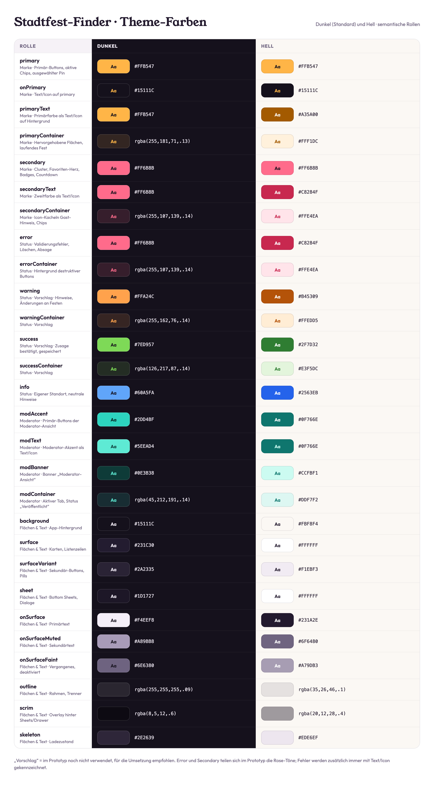

# Theme-Farben

Semantische Farbrollen für **Dunkel (Standard)** und **Hell**. Dieselben Werte stehen maschinenlesbar in [design-tokens.json](design-tokens.json).

**Legende:**
- **„Vorschlag“** heißt, der Prototyp verwendet diese Rolle noch nicht. Sie wird für die Umsetzung empfohlen, damit alle Statusfarben vorhanden sind.
- **„on…“** ist die Farbe für Text und Icons auf der jeweiligen Fläche.

## Marke

| Rolle | Dunkel | Hell | Verwendung |
|---|---|---|---|
| **primary** | `#FFB547` | `#FFB547` | Primär-Buttons, aktive Chips, ausgewählter Pin, laufende Feste |
| onPrimary | `#15111C` | `#15111C` | Text auf primary, in beiden Modi dunkel |
| primaryText | `#FFB547` | `#A35A00` | Primärfarbe als Text/Icon auf Hintergrund, z. B. Lupe, „Läuft …“ |
| primaryContainer | `rgba(255,181,71,.13)` | `#FFF1DC` | Hervorgehobene Flächen, Karte des laufenden Fests, Icon-Kacheln |
| **secondary** | `#FF6B8B` | `#FF6B8B` | Cluster, Favoriten-Herz, Zähler-Badges |
| onSecondary | `#15111C` | `#15111C` | Text auf secondary |
| secondaryText | `#FF6B8B` | `#C8284F` | Countdown „In X Tagen“, Monatslabels der Zeitleiste |
| secondaryContainer | `rgba(255,107,139,.14)` | `#FFE4EA` | Icon-Kachel im Gast-Hinweis |

## Status

| Rolle | Dunkel | Hell | Verwendung |
|---|---|---|---|
| **error** | `#FF6B8B` | `#C8284F` | Feldfehler, Rahmen ungültiger Felder, „Abmelden“, destruktive Aktionen, Status „Abgesagt“ |
| onError | `#15111C` | `#FFFFFF` | Text auf error (z. B. „Endgültig löschen“) |
| errorContainer | `rgba(255,107,139,.14)` | `#FFE4EA` | Hintergrund von „Liste löschen“, „Kategorie löschen“, ✕-Buttons |
| **warning** *(Vorschlag)* | `#FFA24C` | `#B45309` | Hinweise, Änderungsmeldungen, „Angaben fehlen“ im Prüfmodus |
| onWarning | `#15111C` | `#FFFFFF` | |
| warningContainer *(Vorschlag)* | `rgba(255,162,76,.14)` | `#FFEDD5` | |
| **success** *(Vorschlag)* | `#7ED957` | `#2F7D32` | Bestätigungen, z. B. „Gespeichert“ |
| onSuccess | `#15111C` | `#FFFFFF` | |
| successContainer *(Vorschlag)* | `rgba(126,217,87,.14)` | `#E3F5DC` | |
| **info** | `#60A5FA` | `#2563EB` | Eigener Standort auf der Karte, neutrale Hinweise |
| onInfo | `#15111C` | `#FFFFFF` | |

**Hinweis zu error und secondary:** Im Prototyp teilen sich beide die Rose-Töne. Fehler sind deshalb immer zusätzlich durch Text, Rahmen oder Icon erkennbar und nie nur durch die Farbe. Soll error eigenständig werden, bietet sich dunkel `#FF5A5F` / hell `#B91C1C` an. Das ist dann eine bewusste Abweichung vom Prototyp.

## Moderator-Akzent

Die Moderationsansicht ersetzt **primary** durch Türkis, damit sie klar von der Nutzeransicht unterscheidbar ist.

| Rolle | Dunkel | Hell | Verwendung |
|---|---|---|---|
| modPrimary (`modAccent`) | `#2DD4BF` | `#0F766E` | Primär-Buttons, aktive Chips, Pin im Formular |
| onModPrimary (`modOn`) | `#062321` | `#FFFFFF` | Text auf modPrimary |
| modText | `#5EEAD4` | `#0F766E` | Links, Icons, „Beenden“ |
| modBanner | `#0E3B38` | `#CCFBF1` | Banner „Moderator-Ansicht“ |
| modContainer (`modSoft`) | `rgba(45,212,191,.14)` | `#DDF7F2` | Aktiver Tab, Pill „Veröffentlicht“, Leiste der KI-Suche |

## Flächen und Text

| Rolle | Dunkel | Hell | Verwendung |
|---|---|---|---|
| background | `#15111C` | `#FBF8F4` | App-Hintergrund |
| surface | `#231C30` | `#FFFFFF` | Karten, Listenzeilen, Infoblöcke |
| surfaceVariant | `#2A2335` | `#F1EBF3` | Sekundär-Buttons, Pills, inaktive Chips im Sheet |
| sheet | `#1D1727` | `#FFFFFF` | Bottom Sheets, Dialoge |
| drawer | `#1B1624` | `#FFFFFF` | Profil-Drawer |
| floating (`chip`) | `rgba(35,28,48,.94)` | `rgba(255,255,255,.96)` | Suchfeld und Chips über der Karte |
| glass | `rgba(21,17,28,.72)` | `rgba(255,255,255,.88)` | Runde Buttons über Bildern |
| onSurface | `#F4EEF8` | `#231A2E` | Primärtext |
| onSurfaceMuted | `#A89BB8` | `#6F6480` | Sekundärtext |
| onSurfaceFaint | `#6E6380` | `#A79DB3` | Vergangenes, deaktiviert |
| outline | `rgba(255,255,255,.09)` | `rgba(35,26,46,.1)` | Rahmen, Trenner |
| scrim | `rgba(8,5,12,.6)` | `rgba(20,12,28,.4)` | Overlay hinter Sheets und Drawer |
| skeleton | `#2E2639` | `#EDE6EF` | Ladezustand |
| placeholder | `#2C2438` / `#261F31` | `#EFE6F0` / `#E8DDEA` | Bild-Platzhalter (Streifen 135°) |

## Kategorie-Farben (Palette für Moderatoren)

| Standard-Kategorie | Farbe |
|---|---|
| Stadtfest | `#FFB547` |
| Volksfest & Kirmes | `#FF6B8B` |
| Weihnachtsmarkt | `#5EEAD4` |
| Markt & Messe | `#8B9CFF` |
| (frei) | `#7ED957` |
| (frei) | `#C792EA` |

In beiden Modi gleich. Verwendet werden sie als 2-pt-Rand der Marker und des Emoji-Kreises.

## Kontrast

- Text auf **primary**, **secondary** und **modPrimary (dunkel)** ist immer `#15111C`. Weißer Text auf Amber oder Rose ist nicht zulässig.
- Im Hellmodus werden **primaryText** `#A35A00` und **secondaryText** `#C8284F` statt der Flächenfarben genutzt, damit Text auf hellem Grund ausreichend Kontrast hat (≥ 4.5:1).
