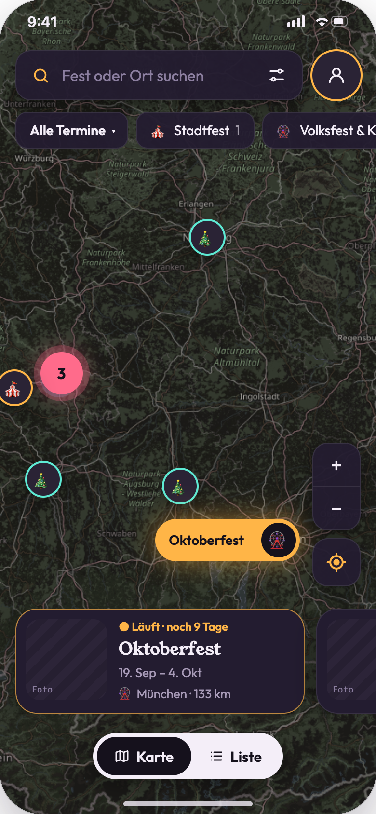
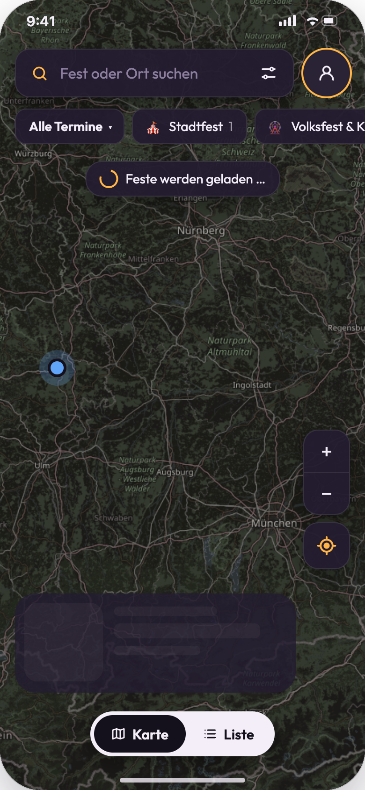
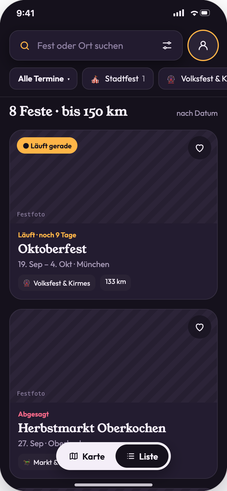
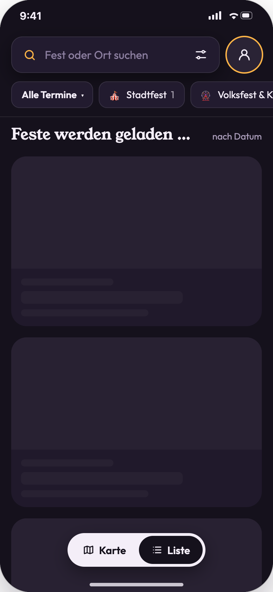
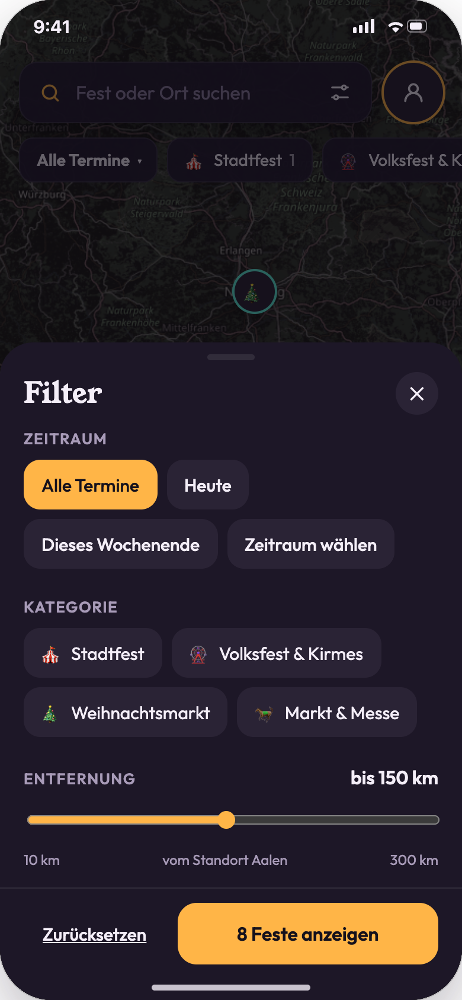
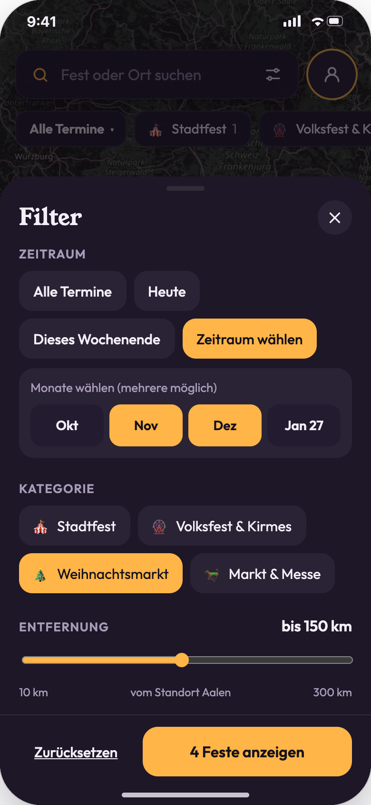
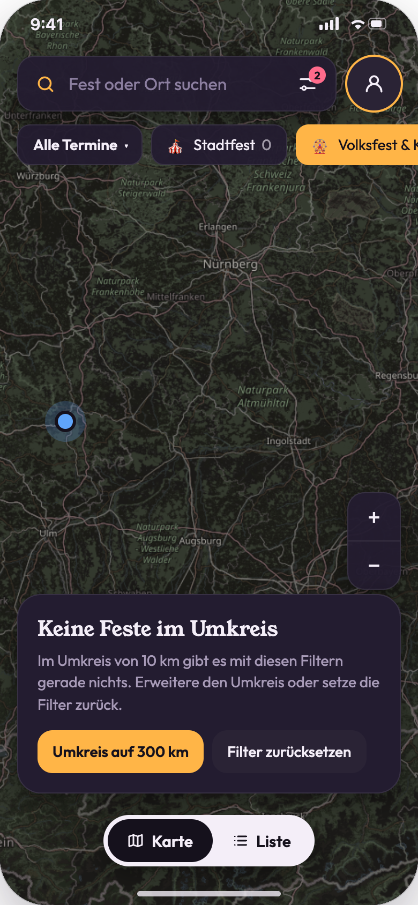
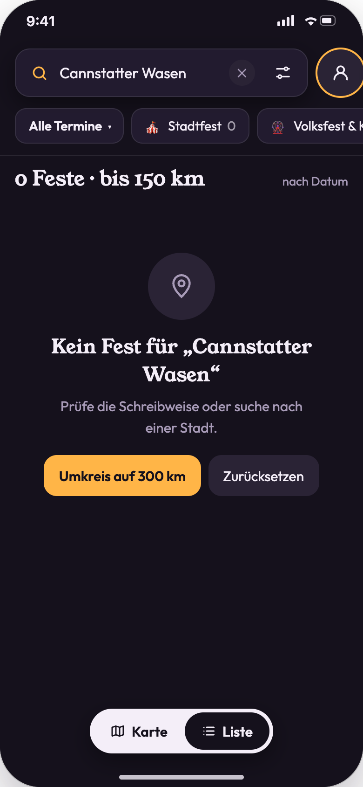
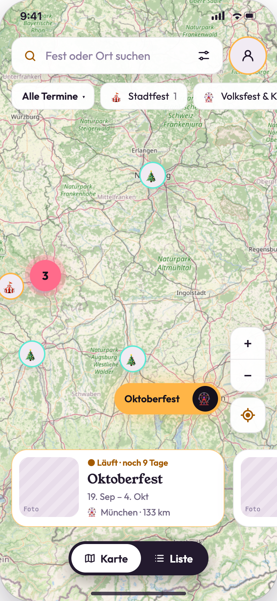
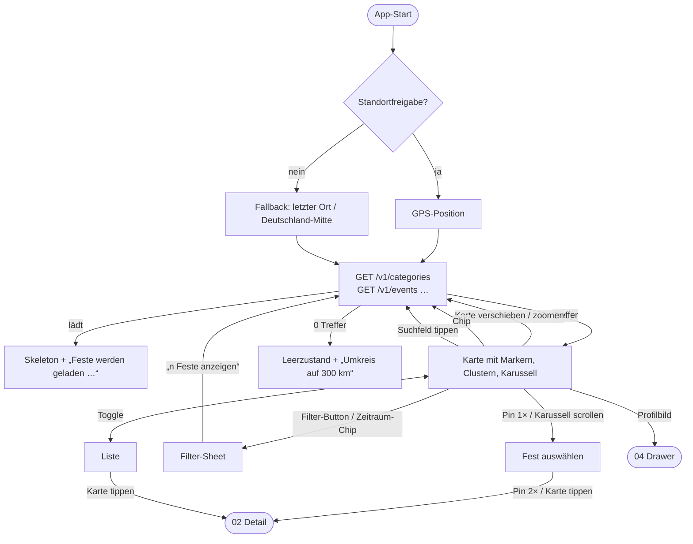

# 01 · Stadtfest-Suche (Karte, Liste, Suche, Filter)

| | |
|---|---|
| **Ziel** | Feste in der Nähe finden, nach Zeitraum, Kategorie und Entfernung eingrenzen und zwischen Karte und Liste wechseln. |
| **Rollen** | Gast, Nutzer, Moderator (gleiches Verhalten) |
| **Moderationsansicht** | Nein. Der Workflow zeigt aber nur, was Moderatoren veröffentlicht haben ([08](08-moderation-feste.md)), und die Chips folgen den Kategorien aus [10](10-moderation-kategorien.md). |
| **Einstieg** | App-Start |
| **Weiter zu** | [02 Fest-Details](02-fest-details.md), [04 Profil-Drawer](04-favoriten-und-zeitleiste.md) |

## Screens

| Karte | Karte lädt | Liste | Liste lädt |
|---|---|---|---|
|  |  |  |  |
| **Filter** | **Filter: Zeitraum wählen** | **Keine Feste im Umkreis** | **Suche ohne Treffer** |
|  |  |  |  |
| **Hellmodus** | | | |
|  | | | |

## Ablauf

## Schritte

| # | Screen | Nutzeraktion | Frontend | Backend | Modus |
|---|---|---|---|---|---|
| 1 | 01-02 | App öffnen | Fragt einmalig nach der Standortfreigabe. Zeigt Skeleton-Karten und die Pille „Feste werden geladen …“. | `GET /v1/categories` (aktive, sortiert, lange cachebar) und `GET /v1/events?bbox=…&from=heute&radiusKm=150` | sync |
| 2 | 01-01 | Karte verschieben oder zoomen | Marker verschieben sich. Nach 300 ms Pause wird für den neuen Ausschnitt nachgeladen, die bereits geladenen Marker bleiben stehen. | `GET /v1/events?bbox=…` (bestehende Filter bleiben) | sync, debounced |
| 3 | 01-01 | Auf einen Cluster tippen | Zoomt 2 Stufen auf den Schwerpunkt des Clusters. | Nachladen wie Schritt 2 | sync |
| 4 | 01-01 | Pin einmal tippen | Pin wird zur Amber-Pille mit Namen. Das Karussell scrollt zur passenden Karte. | – | lokal |
| 5 | 01-01 | Karussell wischen | Die mittige Karte bestimmt den ausgewählten Pin. Liegt er außerhalb des Bildausschnitts, verschiebt sich die Karte. | – | lokal |
| 6 | 01-01 | Pin oder Karte ein zweites Mal tippen | Öffnet die Detailseite ([02](02-fest-details.md)). | `GET /v1/events/{id}` | sync |
| 7 | 01-01 | Kategorie-Chip tippen | Chip wird aktiv (Mehrfachauswahl) und es wird neu geladen. Die Zahl im Chip zählt Feste, die alle anderen Filter erfüllen. | `GET /v1/events?categories=…` | sync |
| 8 | 01-01 | Text in die Suche eingeben | Filtert nach Name oder Ort, ✕ leert die Suche. | `GET /v1/events?q=…` (debounced 300 ms, ab 2 Zeichen) | sync |
| 9 | 01-05 | Filter öffnen | Das Sheet zeigt eine Kopie der aktuellen Filter als Entwurf. Die Zahl im Button („8 Feste anzeigen“) aktualisiert sich live. | `GET /v1/events/count?…` (Vorschau, debounced) | sync |
| 10 | 01-06 | „Zeitraum wählen“ | Monatsraster mit Mehrfachauswahl. | – | lokal |
| 11 | 01-05 | Entfernung schieben | 10–300 km in 10er-Schritten, vom aktuellen Standort. | Vorschau wie Schritt 9 | sync |
| 12 | 01-05 | „n Feste anzeigen“ | Übernimmt den Entwurf, schließt das Sheet, lädt neu. Der Filter-Button zeigt die Zahl aktiver Filter. | `GET /v1/events?…` | sync |
| 13 | 01-05 | „Zurücksetzen“ | Setzt den Entwurf auf Standard zurück (alle Termine, alle Kategorien, 150 km). | – | lokal |
| 14 | 01-01 ↔ 01-03 | Toggle Karte / Liste | Wechselt die Ansicht. Suche, Filter und Auswahl bleiben erhalten, es wird nicht neu geladen. | – | lokal |
| 15 | 01-03 | Herz in der Liste | Gast: Hinweis ([03](03-authentifizierung.md)). Nutzer: Favorit umschalten ([04](04-favoriten-und-zeitleiste.md)). | `PUT/DELETE /v1/me/favorites/{id}` | sync (optimistisch) |
| 16 | 01-01 | Standort-Button | Zentriert auf die eigene Position, Zoom 10. | Nachladen wie Schritt 2 | sync |
| 17 | 01-07 | „Umkreis auf 300 km“ | Setzt den Radius auf 300 km und lädt neu. | `GET /v1/events?radiusKm=300` | sync |
| 18 | 01-07 | „Filter zurücksetzen“ | Setzt Filter und Suche zurück und lädt neu. | `GET /v1/events` | sync |

## Zustände

| Zustand | Darstellung |
|---|---|
| Laden | Skeleton-Karten im Karussell bzw. in der Liste, Pille „Feste werden geladen …“ auf der Karte (01-02, 01-04). |
| Keine Feste mit den Filtern | Karte „Keine Feste im Umkreis“ mit Radius und zwei Aktionen (01-07). |
| Suche ohne Treffer | „Kein Fest für ‚{q}‘“ mit Hinweis auf die Schreibweise (01-08). |
| Keine Standortfreigabe | Karte startet auf dem letzten bekannten Ort bzw. Deutschland-Mitte. Die Entfernung wird zum Kartenmittelpunkt berechnet (Annahme). |
| Netzwerkfehler | Toast „Feste konnten nicht geladen werden“ mit „Erneut versuchen“. Bereits geladene Marker bleiben stehen (Annahme). |

## Regeln

- Angezeigt werden nur Feste mit Status **veröffentlicht** oder **abgesagt** und Ende ≥ heute. Abgesagte Feste tragen den roten Status „Abgesagt“.
- **Sortierung** im Karussell und in der Liste: nach Beginn aufsteigend, laufende zuerst.
- **Status-Text:**
  - laufend: „Läuft · noch X Tage“ (Amber)
  - Beginn in ≤ 14 Tagen: „In X Tagen“ (Rosa)
  - sonst: „Ab {Datum}“
- **Clustering:** Marker unter 46 px Abstand werden zusammengefasst. Der ausgewählte Marker ist nie Teil eines Clusters.
- **Zeitraum:**
  - „Heute“: Das Fest läuft heute.
  - „Dieses Wochenende“: Überschneidung mit Samstag oder Sonntag der laufenden Woche.
  - Monate: Überschneidung mit mindestens einem gewählten Monat.
- **Marker-Rand** in der Farbe der Kategorie ([10](10-moderation-kategorien.md)).

## Offene Punkte

- Frei wählbarer Zeitraum mit Kalender statt Monatsraster? Der Prototyp nutzt Monate, das Briefing verlangt „frei wählbar“.
- Soll die Karte clientseitig clustern oder das Backend vorgeclusterte Kacheln liefern (ab ca. 500 Festen empfehlenswert)?
