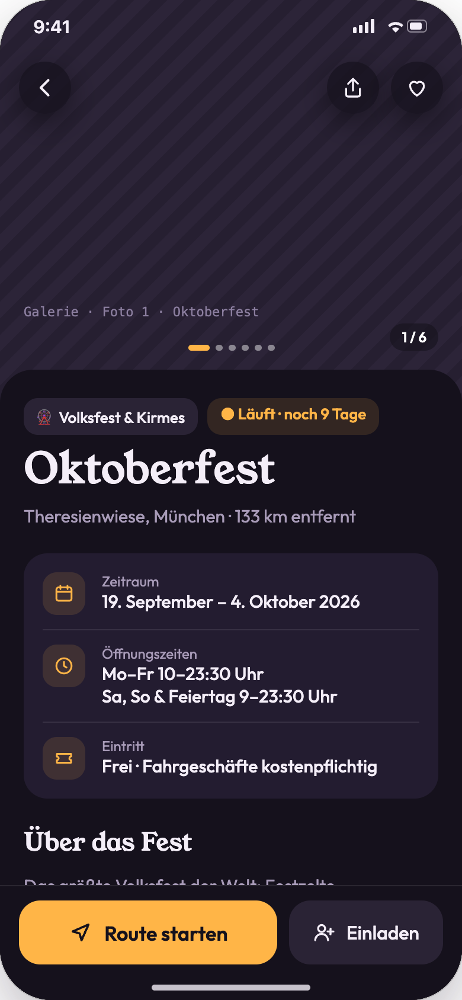
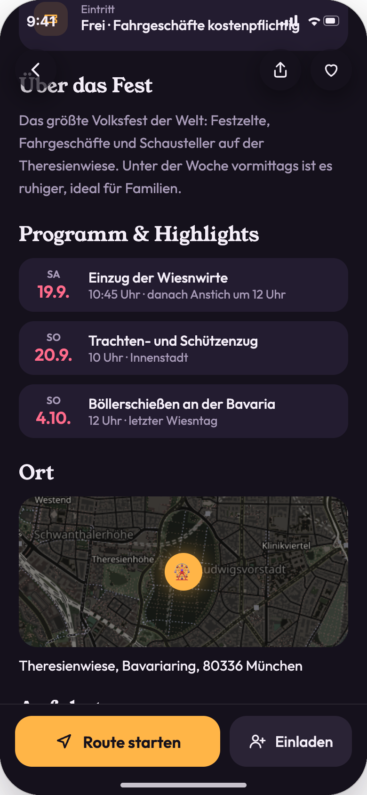
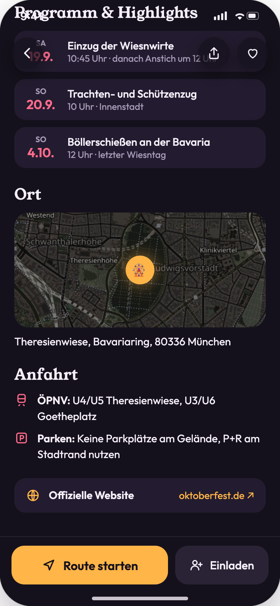
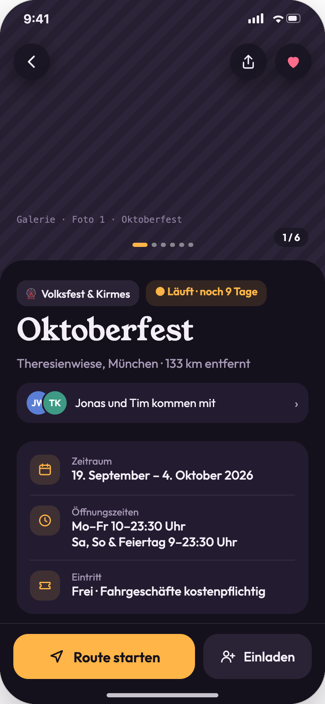
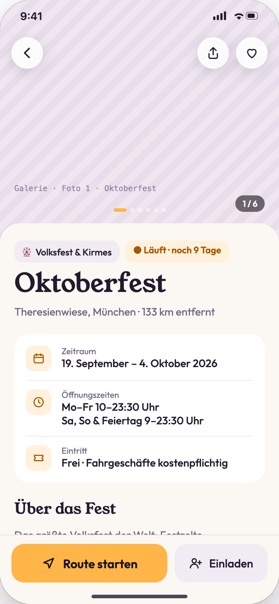
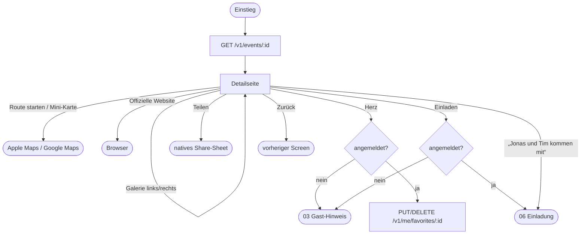

# 02 · Fest-Details

| | |
|---|---|
| **Ziel** | Alle Informationen zu einem Fest ansehen und von dort aus handeln: Route, Website, Favorit, Teilen, Einladen. |
| **Rollen** | Gast, Nutzer |
| **Moderationsansicht** | Nein. Die Inhalte pflegen Moderatoren in [08](08-moderation-feste.md). Moderatoren sehen hier dieselbe Seite wie Nutzer. |
| **Einstieg** | Karte oder Liste ([01](01-stadtfest-suche.md)), Zeitleiste ([04](04-favoriten-und-zeitleiste.md)), gemeinsame Liste ([05](05-gemeinsame-listen.md)), Benachrichtigung ([07](07-benachrichtigungen.md)), Deep Link `stadtfest-finder.de/f/{id}` |
| **Weiter zu** | [03](03-authentifizierung.md) (Gast), [06 Einladungen](06-einladungen.md), externe Karten-App, Browser |

## Screens

| Oben: Galerie, Eckdaten | Beschreibung, Programm | Ort, Anfahrt, Website |
|---|---|---|
|  |  |  |
| **Angemeldet: Favorit aktiv, „kommen mit“** | **Hellmodus** | |
|  |  | |

## Ablauf

## Schritte

| # | Screen | Nutzeraktion | Frontend | Backend | Modus |
|---|---|---|---|---|---|
| 1 | 02-01 | Detailseite öffnen | Schiebt von rechts herein. Daten aus der Liste werden sofort angezeigt, der Rest wird nachgeladen. | `GET /v1/events/{id}` (für angemeldete Nutzer inkl. `isFavorite` und `invitationSummary`) | sync |
| 2 | 02-01 | Galerie links/rechts tippen | Blättert Bilder, Punkte und Zähler „1 / 6“ laufen mit. | Bilder per CDN-URL | lokal |
| 3 | 02-01 | Herz (Gast) | Bottom Sheet „Lieblingsfeste merken“ ([03](03-authentifizierung.md)). Das Fest wird als offene Aktion gemerkt. | – | lokal |
| 4 | 02-04 | Herz (Nutzer) | Herz füllt sich sofort, Toast „Zu Favoriten hinzugefügt“. Bei Fehler wird zurückgesetzt und ein Toast angezeigt. | `PUT /v1/me/favorites/{id}` bzw. `DELETE …` | sync (optimistisch) |
| 5 | 02-01 | Teilen (Gast und Nutzer) | Öffnet das native Share-Sheet mit Titel, Zeitraum und Link `https://stadtfest.herderstreet.de/f/{id}`. Kein Konto nötig (Entscheidung 29.09.2026). | – (Link wird clientseitig gebildet) | lokal |
| 6 | 02-01 | Einladen | Gast: Hinweis. Nutzer: Einladung verfassen oder Zu-/Absage-Übersicht ([06](06-einladungen.md)). | `GET /v1/events/{id}/invitation` | sync |
| 7 | 02-03 | Route starten / Mini-Karte | Öffnet die Standard-Karten-App mit den Zielkoordinaten. | – | lokal |
| 8 | 02-03 | Offizielle Website | Öffnet den In-App-Browser bzw. den Systembrowser. | – | lokal |
| 9 | 02-04 | „Jonas und Tim kommen mit“ | Öffnet die Zu-/Absage-Übersicht der eigenen Einladung. | `GET /v1/events/{id}/invitation` | sync |

## Inhalte und Datenfelder

| Bereich | Felder | Pflicht beim Veröffentlichen ([08](08-moderation-feste.md)) |
|---|---|---|
| Galerie | `images[]` (erstes = Titelbild) | nein (Platzhalter, wenn leer) |
| Kopf | `category`, Status (abgeleitet), `name`, `place`, `city`, Entfernung (berechnet) | Name, Kategorie, Ort |
| Infoblock | `startDate`, `endDate`, `openingHours[]`, `price` | Beginn, Ende |
| Über das Fest | `description` | nein |
| Programm & Highlights | `program[] {date, title, subtitle}` | nein, Abschnitt entfällt wenn leer |
| Ort | `lat`, `lon`, `address` → Mini-Karte | Adresse oder Pin |
| Anfahrt | `transit`, `parking` | nein |
| Website | `websiteUrl` | nein |

## Zustände

| Zustand | Darstellung |
|---|---|
| Laden | Titel und Eckdaten aus der Liste sind sofort da, die übrigen Abschnitte als Skeleton (Annahme). |
| Abgesagt | Rote Status-Pill „Abgesagt“. Die Aktionen bleiben erreichbar, Einladen ist deaktiviert (Annahme). |
| Fest gelöscht / nicht gefunden | Bei `404`: Hinweis „Dieses Fest ist nicht mehr verfügbar“, zurück zur Karte (Annahme). |
| Keine Bilder | Gestreifter Platzhalter. |
