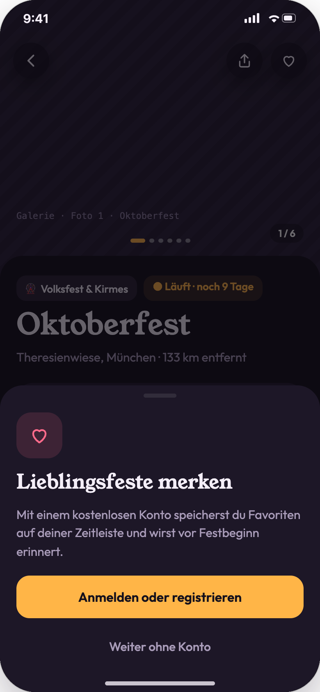
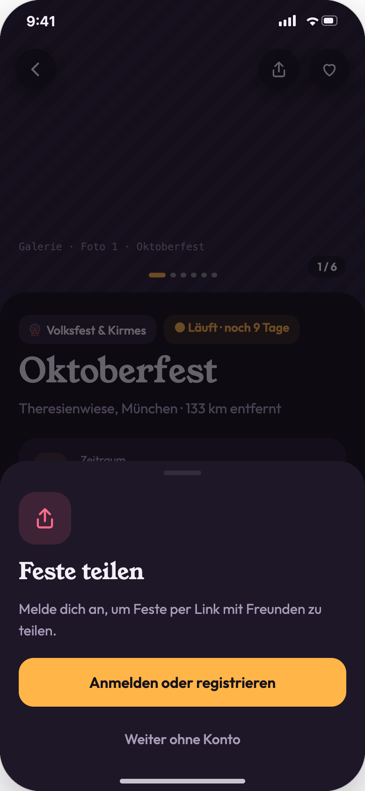
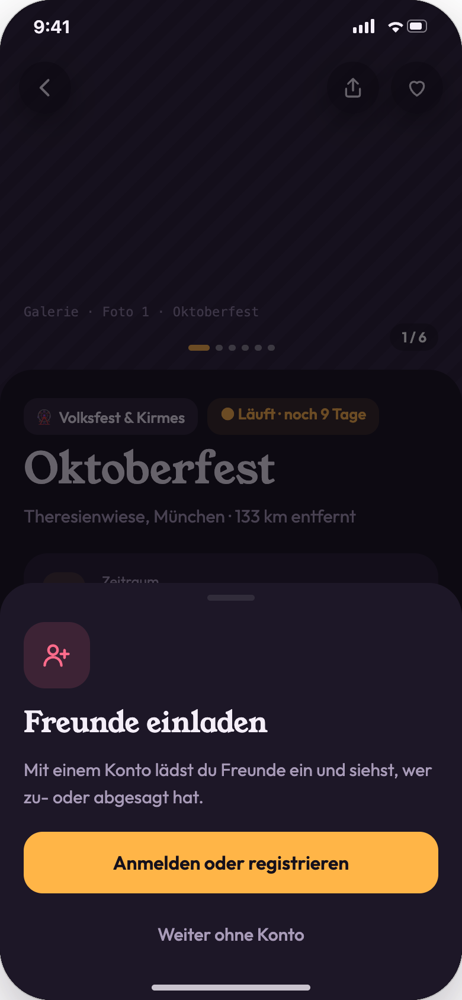
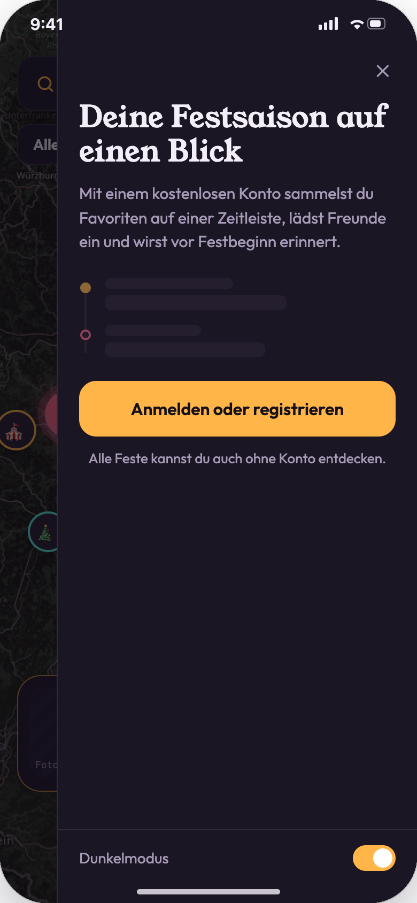
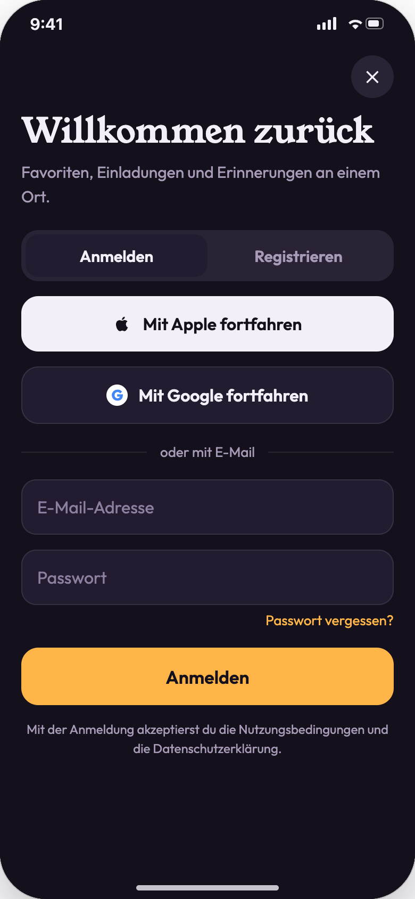
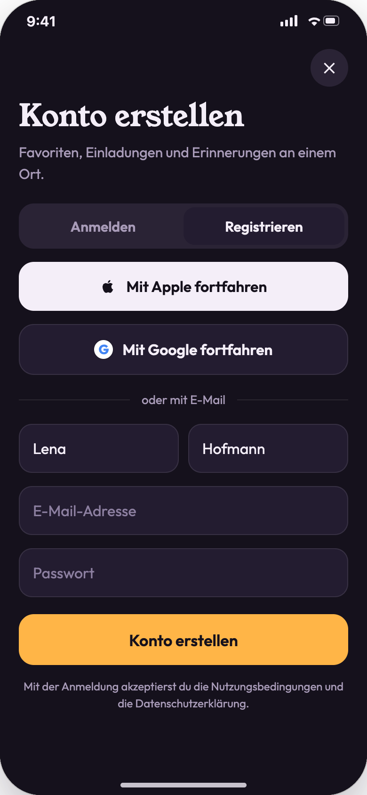
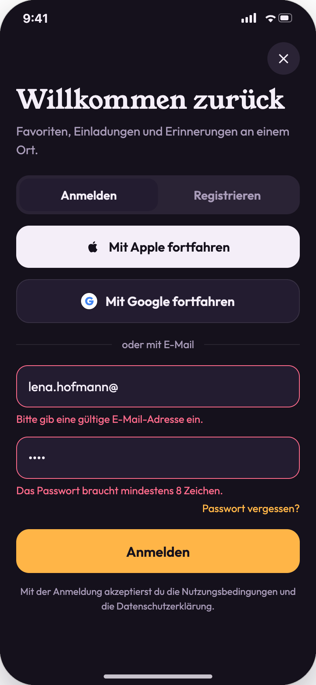
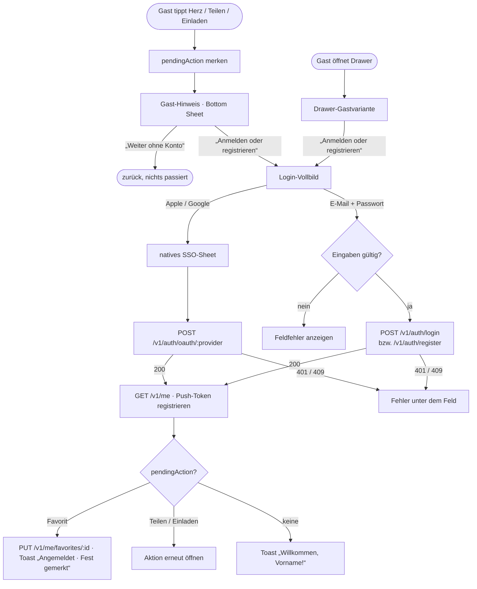

# 03 · Authentifizierung

| | |
|---|---|
| **Ziel** | Gäste nicht blockieren, aber bei Account-Funktionen freundlich zur Anmeldung führen. Anmeldung und Registrierung per Apple, Google oder E-Mail. Abmelden. |
| **Rollen** | Gast → Nutzer (Moderatoren melden sich genauso an, die Rolle kommt vom Backend) |
| **Moderationsansicht** | Nein. Nach der Anmeldung liefert `GET /v1/me` die Rollen. Nur bei `moderator` erscheint im Drawer der Link „Moderator-Ansicht“. |
| **Einstieg** | Account-Aktion als Gast (Herz, Teilen, Einladen), Profil-Drawer als Gast |
| **Weiter zu** | zurück zur ausgelösten Aktion; die Aktion wird nachgeholt |

## Screens

| Hinweis: Favorit | Hinweis: Teilen | Hinweis: Einladen | Drawer als Gast |
|---|---|---|---|
|  |  |  |  |
| **Anmelden** | **Registrieren** | **Validierungsfehler** | |
|  |  |  | |

## Ablauf

## Schritte

| # | Screen | Nutzeraktion | Frontend | Backend | Modus |
|---|---|---|---|---|---|
| 1 | 03-01…03 | Account-Aktion als Gast | Bottom Sheet mit passendem Icon und Text. Die Aktion wird als `pendingAction {type, eventId}` gemerkt. Nichts wird blockiert. | – | lokal |
| 2 | 03-01 | „Weiter ohne Konto“ | Schließt das Sheet, `pendingAction` wird verworfen. | – | lokal |
| 3 | 03-04 | Anmelden öffnen | Vollbild von unten. Segment „Anmelden \| Registrieren“. | – | lokal |
| 4 | 03-04 | „Mit Apple fortfahren“ / „Mit Google fortfahren“ | Natives Sign-in-Sheet der Plattform. Der erhaltene ID-Token geht an das Backend. | `POST /v1/auth/oauth/apple` bzw. `/google {idToken}` → `{accessToken, refreshToken, user}`. Neuer Account wird automatisch angelegt. | sync |
| 5 | 03-05 | Registrieren (E-Mail) | Vorname, Nachname, E-Mail, Passwort. Validierung im Client. | `POST /v1/auth/register` → Tokens. Zusätzlich wird eine Bestätigungs-E-Mail verschickt. | sync + async (E-Mail) |
| 6 | 03-04 | Anmelden (E-Mail) | Button zeigt Spinner und „Einen Moment …“. | `POST /v1/auth/login {email, password}` | sync |
| 7 | 03-06 | Ungültige Eingabe | Feldfehler: E-Mail-Format, Passwort ≥ 8 Zeichen. Fehler vom Server: „E-Mail oder Passwort falsch“ (401), „Diese E-Mail ist bereits registriert“ (409). | – bzw. Fehlerantwort | lokal / sync |
| 8 | 03-04 | „Passwort vergessen?“ | Eingabe der E-Mail, Bestätigung „Wir haben dir einen Link geschickt“. | `POST /v1/auth/password-reset {email}` → immer `202` | async |
| 9 | – | Anmeldung erfolgreich | Tokens sicher speichern (Keychain/Keystore). Profil laden und Push-Token registrieren. `pendingAction` ausführen. | `GET /v1/me`, `POST /v1/me/devices {pushToken, platform}` | sync |
| 10 | 04-01 | „Abmelden“ im Drawer | Tokens löschen, Stapel der Unterseiten schließen, Toast „Du bist abgemeldet“. | `POST /v1/auth/logout` (Refresh-Token widerrufen, Push-Token entfernen) | sync |
| 11 | – | Access-Token läuft ab | Stilles Erneuern. Schlägt das fehl, Rückfall in den Gastmodus mit Toast. | `POST /v1/auth/refresh` | sync |

## Regeln

- Die App ist **ohne Account vollständig nutzbar** für Karte, Liste, Suche, Filter und Details.
- Der Gast-Hinweis ist ein **Bottom Sheet**, kein Vollbild. Er schließt per Tipp auf den Hintergrund.
- Die **Rolle** wird ausschließlich vom Backend bestimmt (`GET /v1/me` → `roles`, `region`).
- **Passwort:** mindestens 8 Zeichen. Fehlertexte: „Bitte gib eine gültige E-Mail-Adresse ein.“, „Das Passwort braucht mindestens 8 Zeichen.“
- Beim Registrieren mit Apple ohne Namensfreigabe wird der Vorname beim ersten Öffnen des Drawers abgefragt (Annahme).

## Offene Punkte

- Muss die E-Mail vor der ersten Account-Aktion bestätigt sein? Der Prototyp verlangt das nicht.
- Account löschen (App-Store-Pflicht) ist nicht gestaltet und sollte in den Einstellungen ergänzt werden.
