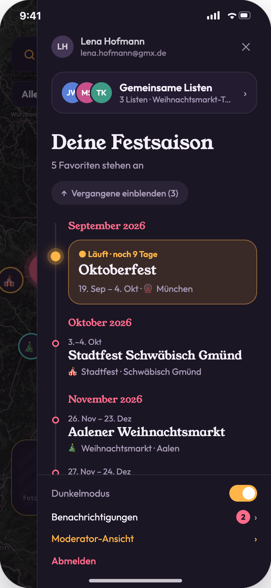
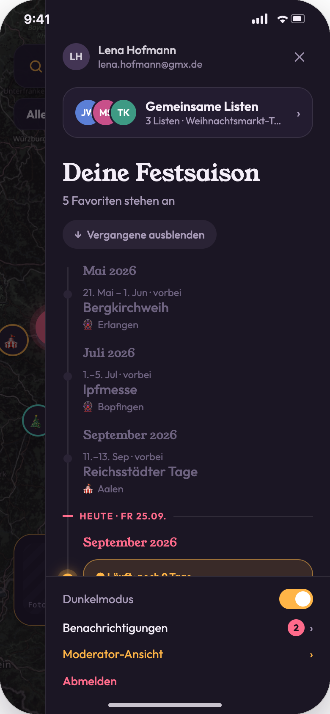
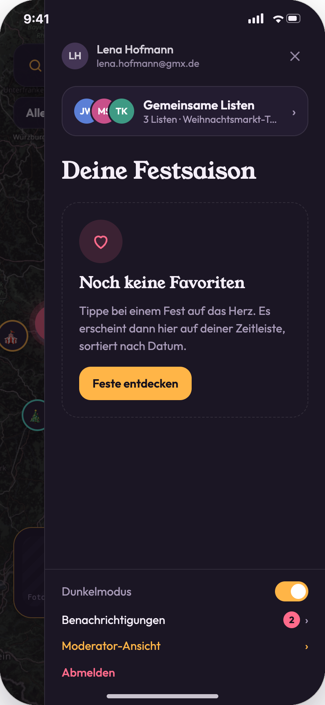
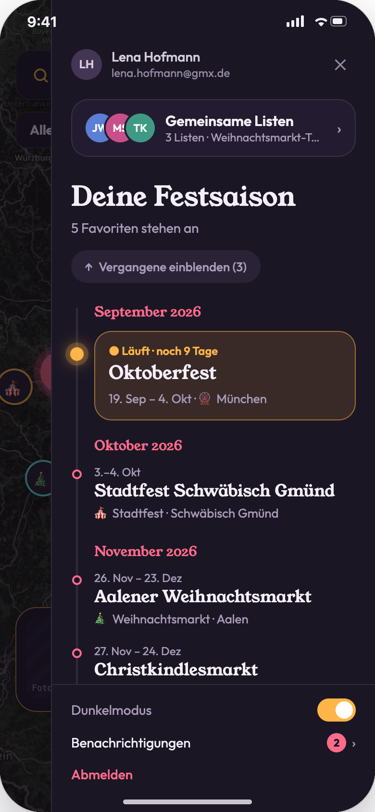
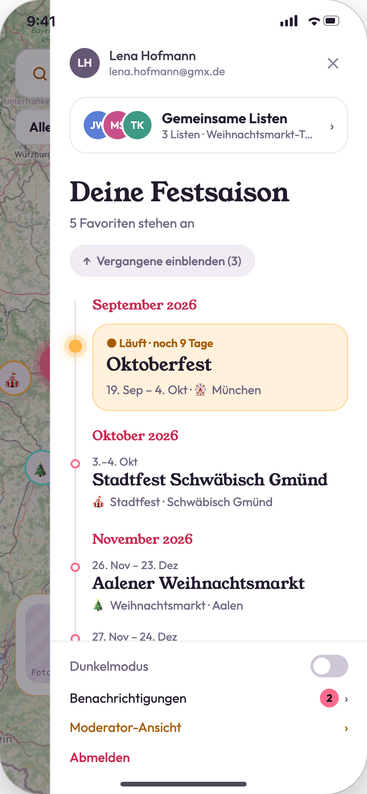
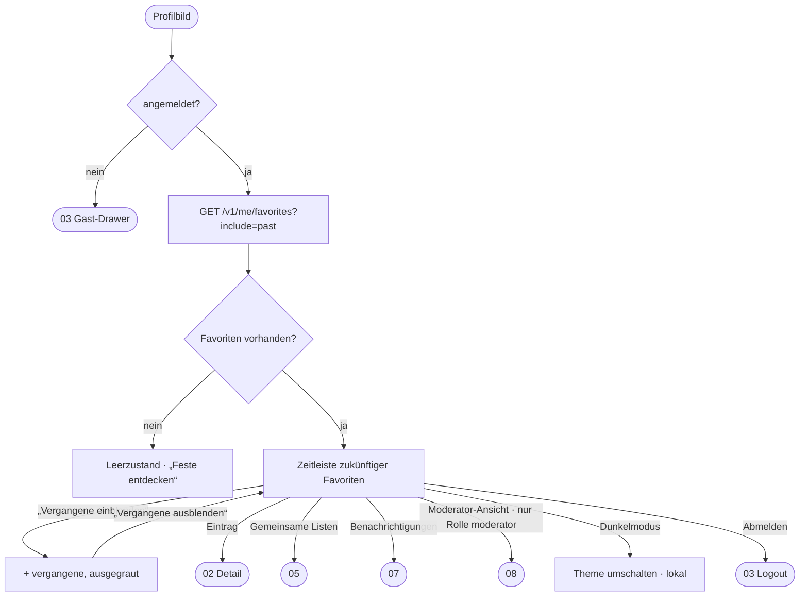

# 04 · Favoriten und Zeitleiste (Profil-Drawer)

| | |
|---|---|
| **Ziel** | Feste merken und die eigene Festsaison chronologisch überblicken. Der Drawer ist außerdem der Einstieg in Listen, Benachrichtigungen, Darstellung und Moderation. |
| **Rollen** | Nutzer, Moderator (Gäste sehen die Anmelde-Variante, siehe [03](03-authentifizierung.md)) |
| **Moderationsansicht** | **Einstieg:** Nur bei der Rolle `moderator` steht im Fußbereich der Link „Moderator-Ansicht“ → [08](08-moderation-feste.md). |
| **Einstieg** | Profilbild oben rechts auf Karte und Liste |
| **Weiter zu** | [02](02-fest-details.md), [05](05-gemeinsame-listen.md), [07](07-benachrichtigungen.md), [08](08-moderation-feste.md) |

## Screens

| Zeitleiste (Moderator) | Vergangene eingeblendet | Noch keine Favoriten | Nutzer ohne Moderator-Link | Hellmodus |
|---|---|---|---|---|
|  |  |  |  |  |

## Aufbau (von oben nach unten)

1. **Nutzerinfo**, bewusst dezent: Avatar 32 pt, Vor- und Nachname, E-Mail, ✕.
2. **Karte „Gemeinsame Listen“** mit Avataren und Namen der Listen → [05](05-gemeinsame-listen.md).
3. **Hauptelement „Deine Festsaison“**: vertikaler Zeitstrahl aller zukünftigen Favoriten, gruppiert nach Monat. Jeder Eintrag zeigt Datum, Name, Kategorie und Ort. Laufende Feste sind als Amber-Karte hervorgehoben.
4. Button **„Vergangene einblenden (n)“** bzw. „Vergangene ausblenden“. Vergangene Feste stehen ausgegraut oberhalb, getrennt durch die Linie „HEUTE · {Datum}“.
5. **Fußbereich:** Schalter Dunkelmodus, Benachrichtigungen (mit Zähler), „Moderator-Ansicht“ (nur Moderatoren), Abmelden.

## Ablauf

## Schritte

| # | Screen | Nutzeraktion | Frontend | Backend | Modus |
|---|---|---|---|---|---|
| 1 | 04-01 | Profilbild tippen | Drawer fährt von rechts ein (336 pt), Scrim dahinter. | `GET /v1/me/favorites?include=past` (zukünftige und vergangene; wird für die Sitzung gecacht) | sync |
| 2 | 01-03 / 02-04 | Herz setzen oder entfernen | Optimistisch: Die Zeitleiste aktualisiert sich sofort, Toast. | `PUT /v1/me/favorites/{eventId}` / `DELETE …` (idempotent) | sync (optimistisch) |
| 3 | 04-02 | „Vergangene einblenden“ | Blendet vergangene Favoriten ausgegraut oberhalb ein, der Button wechselt den Text. | – (bereits geladen) | lokal |
| 4 | 04-01 | Eintrag tippen | Schließt den Drawer und öffnet die Detailseite. | `GET /v1/events/{id}` | sync |
| 5 | 04-01 | Dunkelmodus umschalten | Wechselt das Theme sofort, Einstellung wird im Gerät gespeichert. | – | lokal |
| 6 | 04-01 | „Moderator-Ansicht“ | Wechselt in die Moderationsansicht ([08](08-moderation-feste.md)). | `GET /v1/mod/events` | sync |
| 7 | 04-03 | „Feste entdecken“ | Schließt den Drawer. | – | lokal |

## Regeln

- **Hervorhebung „läuft“:** Beginn ≤ heute ≤ Ende. Die Karte zeigt „● Läuft · noch X Tage“ mit leuchtendem Punkt.
- **Vergangen:** Ende < heute. Vergangene Favoriten werden nicht gelöscht, nur standardmäßig ausgeblendet.
- **Abgesagte Favoriten** bleiben in der Zeitleiste mit dem Status „Abgesagt“ (Annahme). Gelöschte Feste entfallen.
- Zeitleiste und Karte sind **dieselbe Datenquelle**: Ein Favorit, der auf der Karte gesetzt wird, erscheint ohne Neuladen.
- Der rote Punkt am Profilbild zeigt ungelesene Benachrichtigungen an ([07](07-benachrichtigungen.md)).
