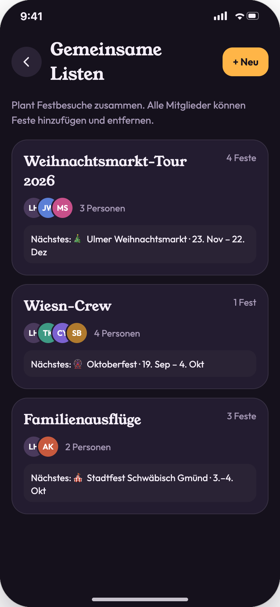
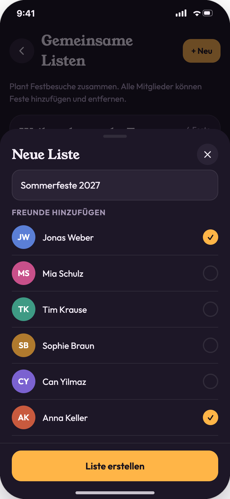
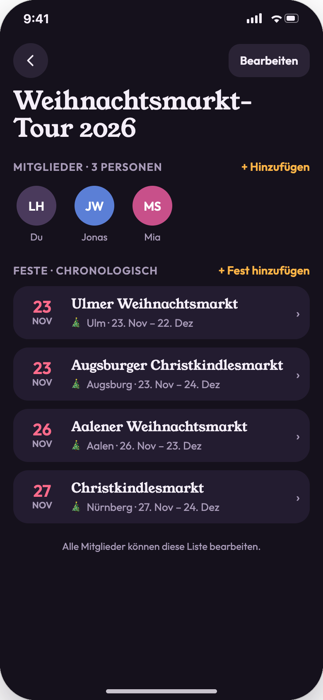
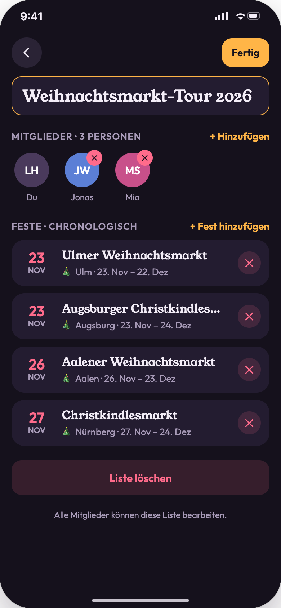
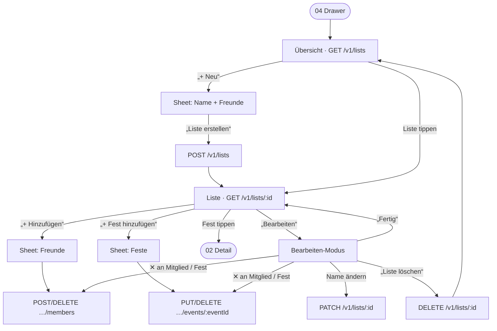

# 05 · Gemeinsame Listen

| | |
|---|---|
| **Ziel** | Mit Freunden gemeinsame Favoritenlisten anlegen und pflegen, z. B. „Weihnachtsmarkt-Tour 2026“. |
| **Rollen** | Nutzer |
| **Moderationsansicht** | Nein |
| **Einstieg** | Karte „Gemeinsame Listen“ im Profil-Drawer ([04](04-favoriten-und-zeitleiste.md)) |
| **Weiter zu** | [02 Fest-Details](02-fest-details.md) |

## Screens

| Übersicht | Neue Liste | Liste ansehen | Liste bearbeiten |
|---|---|---|---|
|  |  |  |  |

## Ablauf

## Schritte

| # | Screen | Nutzeraktion | Frontend | Backend | Modus |
|---|---|---|---|---|---|
| 1 | 05-01 | Übersicht öffnen | Karten zeigen Name, Anzahl der Feste, Avatare, „{n} Personen“ und das nächste anstehende Fest. | `GET /v1/lists` | sync |
| 2 | 05-02 | „+ Neu“ | Sheet mit Namensfeld und Freundesliste (Häkchen). „Liste erstellen“ ist erst mit Namen aktiv. | `GET /v1/me/friends` | sync |
| 3 | 05-02 | „Liste erstellen“ | Öffnet die neue Liste, Toast „Liste erstellt“. | `POST /v1/lists {name, memberIds[]}`. Hinzugefügte Mitglieder bekommen eine Benachrichtigung. | sync + async (Push) |
| 4 | 05-03 | Liste öffnen | Mitglieder als Avatare, Feste chronologisch mit Datumsblock. Vergangene Feste halbtransparent. | `GET /v1/lists/{id}` | sync |
| 5 | 05-03 | „+ Hinzufügen“ (Mitglieder) | Sheet mit Mehrfachauswahl. Jede Änderung wirkt sofort. | `POST /v1/lists/{id}/members {userId}` / `DELETE …/members/{userId}` | sync (optimistisch) |
| 6 | 05-03 | „+ Fest hinzufügen“ | Sheet mit allen anstehenden Festen, Mehrfachauswahl. | `PUT /v1/lists/{id}/events/{eventId}` / `DELETE …` | sync (optimistisch) |
| 7 | 05-04 | „Bearbeiten“ | Name wird zum Eingabefeld, ✕ an Mitgliedern und Festen, „Liste löschen“ erscheint. | – | lokal |
| 8 | 05-04 | Name ändern | Speichert beim Verlassen des Felds bzw. mit „Fertig“. | `PATCH /v1/lists/{id} {name}` | sync |
| 9 | 05-04 | „Liste löschen“ | Löscht die Liste, zurück zur Übersicht, Toast. | `DELETE /v1/lists/{id}` | sync |
| 10 | 05-03 | Fest tippen | Öffnet die Detailseite. | `GET /v1/events/{id}` | sync |

## Regeln

- **Alle Mitglieder** dürfen Name, Mitglieder und Feste ändern. Der Ersteller hat keine Sonderrechte (so im Prototyp).
- Der eigene Account ist immer Mitglied und lässt sich nicht entfernen. Zum Verlassen einer fremden Liste ist „Liste verlassen“ vorgesehen (Annahme, nicht gestaltet).
- Feste in Listen sind **unabhängig von persönlichen Favoriten**.
- Gleichzeitige Änderungen: Das Backend arbeitet mit Einzeloperationen (hinzufügen/entfernen), nicht mit dem Ersetzen der ganzen Liste. So gibt es keine Konflikte.
- **Freunde** sind Accounts, mit denen bereits eine Verbindung besteht. Wie Freundschaften entstehen, z. B. über einen Einladungslink, ist nicht gestaltet (siehe offene Punkte).

## Offene Punkte

- Freunde finden und hinzufügen (Kontakte, Link, QR-Code) ist nicht Teil der gestalteten Screens.
- Sollen Mitglieder über Änderungen an einer Liste benachrichtigt werden? Bisher nur beim Hinzufügen zu einer Liste vorgesehen.
