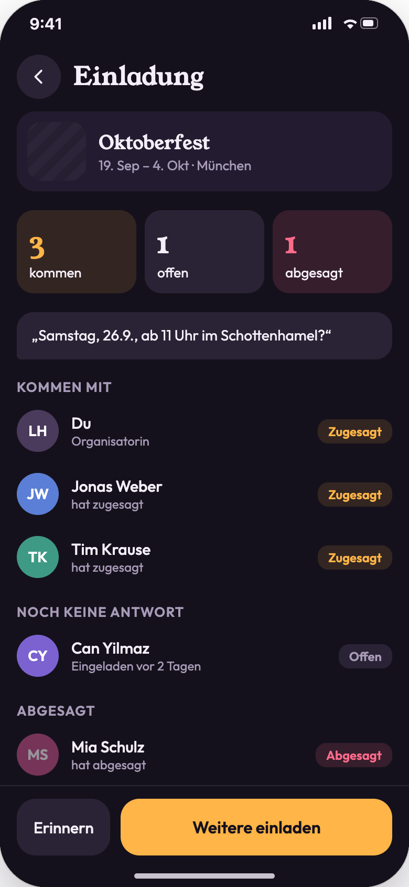
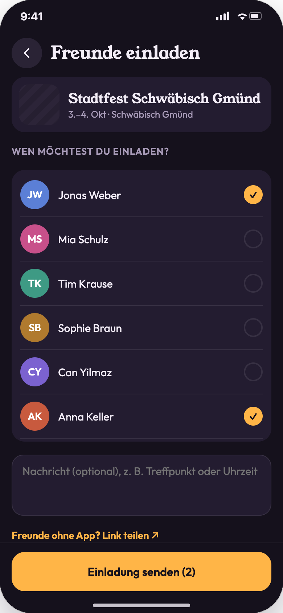
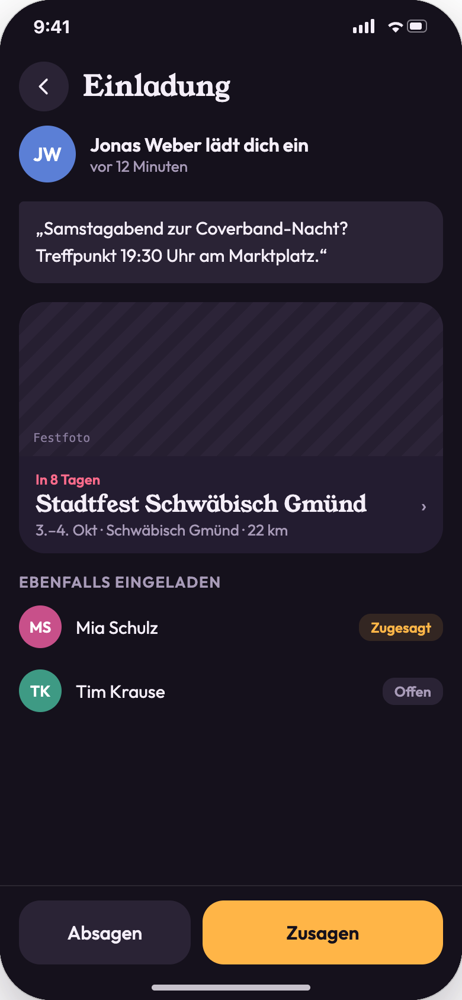
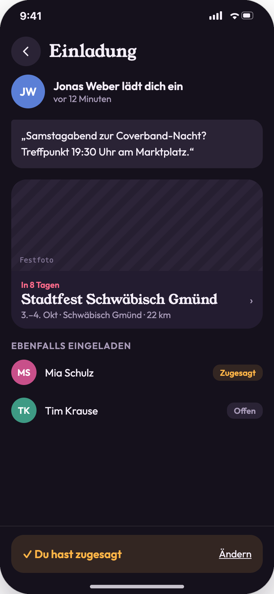
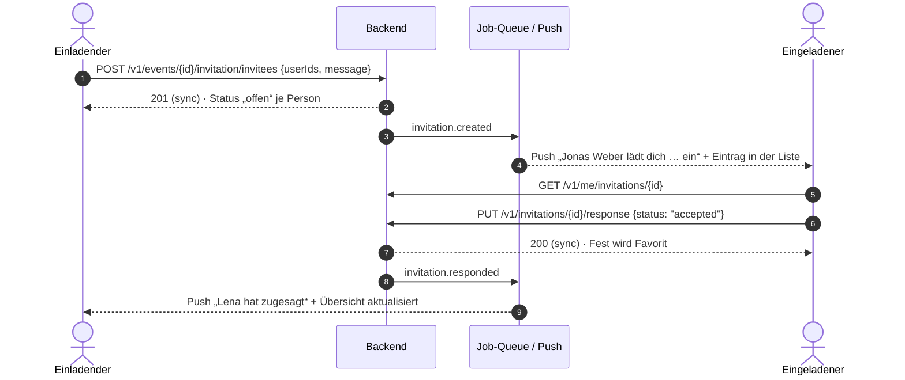

# 06 · Einladungen

| | |
|---|---|
| **Ziel** | Freunde zu einem Fest einladen. Eingeladene sagen zu oder ab, der Einladende sieht, wer kommt. |
| **Rollen** | Nutzer (als Einladender und als Eingeladener) |
| **Moderationsansicht** | Nein. Wird ein Fest abgesagt ([08](08-moderation-feste.md)), erhalten auch alle Eingeladenen mit Zusage eine Benachrichtigung (Annahme). |
| **Einstieg** | „Einladen“ auf der Detailseite ([02](02-fest-details.md)), Hinweis „… kommen mit“, Benachrichtigung ([07](07-benachrichtigungen.md)), Deep Link |
| **Weiter zu** | [02 Fest-Details](02-fest-details.md) |

## Screens

| Zu-/Absage-Übersicht | Einladung verfassen | Erhaltene Einladung | Zugesagt |
|---|---|---|---|
|  |  |  |  |

## Ablauf: Einladender

```mermaid
flowchart TD
  D([02 Detail · „Einladen“]) --> G[GET /v1/events/:id/invitation]
  G -->|noch keine Einladung| C[Verfassen: Freunde + Nachricht]
  G -->|Einladung existiert| O[Übersicht: kommen / offen / abgesagt]
  C -->|„Einladung senden (n)“| S[POST …/invitation/invitees] --> O
  O -->|„Weitere einladen“| C
  O -->|„Erinnern“| R[POST /v1/invitations/:id/reminders]
  C -->|„Link teilen“| SH([Share-Sheet mit Einladungslink])
```

## Ablauf: Eingeladener



## Schritte

| # | Screen | Nutzeraktion | Frontend | Backend | Modus |
|---|---|---|---|---|---|
| 1 | 06-02 | „Einladen“ ohne bestehende Einladung | Freundesliste mit Häkchen, optionale Nachricht. Der Button „Einladung senden (n)“ ist ohne Auswahl deaktiviert. | `GET /v1/me/friends` | sync |
| 2 | 06-02 | „Einladung senden“ | Wechselt zur Übersicht, Toast „2 Einladungen verschickt“. | `POST /v1/events/{id}/invitation/invitees {userIds[], message}` | sync + async (Push an Eingeladene) |
| 3 | 06-02 | „Freunde ohne App? Link teilen“ | Share-Sheet mit Einladungslink. | `POST /v1/events/{id}/invitation/link` → URL | sync |
| 4 | 06-01 | Übersicht öffnen | Kacheln „kommen / offen / abgesagt“, Nachricht als Sprechblase, Gruppen mit Personen. Der Einladende zählt als „kommt“. | `GET /v1/events/{id}/invitation` | sync |
| 5 | 06-01 | „Erinnern“ | Toast „Erinnerung an n Offene verschickt“, bzw. „Alle haben geantwortet“. | `POST /v1/invitations/{id}/reminders` (höchstens 1× pro 24 h) | async |
| 6 | 06-01 | „Weitere einladen“ | Verfassen-Ansicht, bereits Eingeladene sind ausgeblendet. | wie Schritt 2 | sync + async |
| 7 | 06-03 | Einladung öffnen (Push oder Liste) | Einladender, Zeitpunkt, Nachricht, Fest-Karte, andere Eingeladene mit Status. | `GET /v1/me/invitations/{id}` | sync |
| 8 | 06-03 | „Zusagen“ | Banner „✓ Du hast zugesagt“. Das Fest wird automatisch Favorit. | `PUT /v1/invitations/{id}/response {status:"accepted"}` | sync + async (Push an Einladenden) |
| 9 | 06-03 | „Absagen“ | Banner „Du hast abgesagt“. | `PUT … {status:"declined"}` | sync + async |
| 10 | 06-04 | „Ändern“ | Setzt die Antwort zurück auf offen, beide Buttons erscheinen wieder. | `PUT … {status:"open"}` | sync |
| 11 | 06-03 | Fest-Karte tippen | Öffnet die Detailseite. | `GET /v1/events/{id}` | sync |

## Regeln

- Pro Nutzer und Fest gibt es **eine Einladung** mit beliebig vielen Eingeladenen und einer gemeinsamen Nachricht.
- Eine **Zusage** fügt das Fest serverseitig den Favoriten hinzu. Eine spätere Absage entfernt den Favoriten nicht.
- Auf der Detailseite zeigt ein Hinweis „{Namen} kommen mit“, sobald es eine Einladung gibt.
- **Push-Empfang** folgt den Einstellungen „Einladungen“ bzw. „Zu- und Absagen“ ([07](07-benachrichtigungen.md)).
- Einladungen zu vergangenen oder abgesagten Festen sind nicht möglich.
