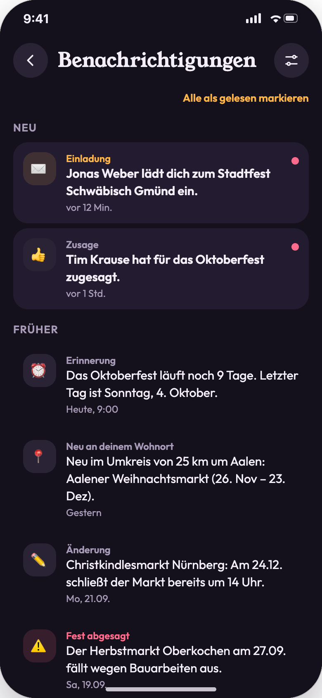
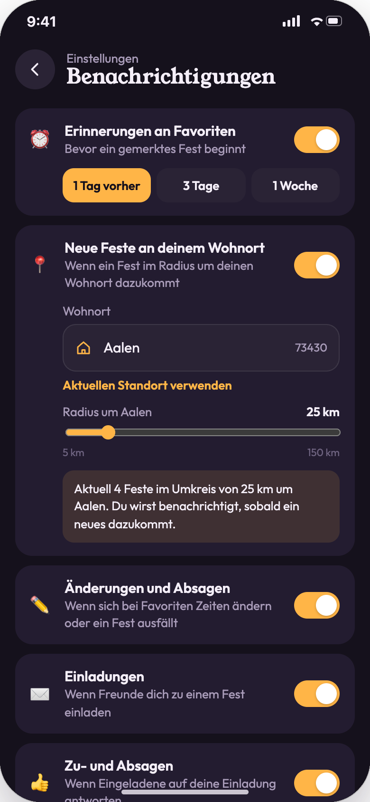
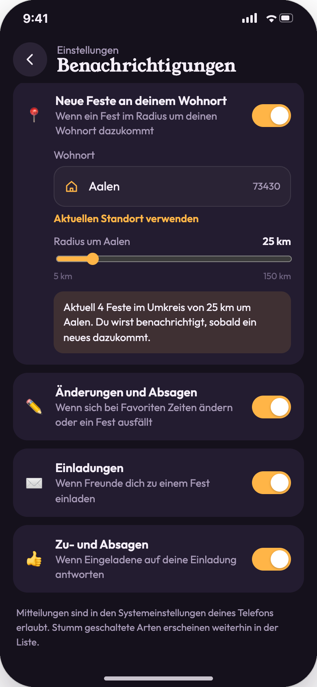
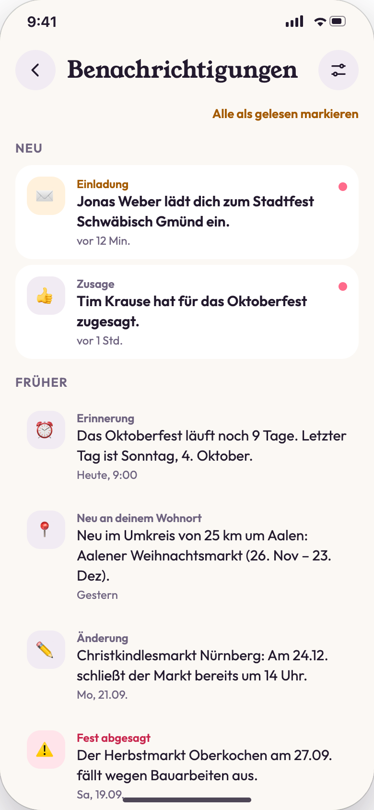
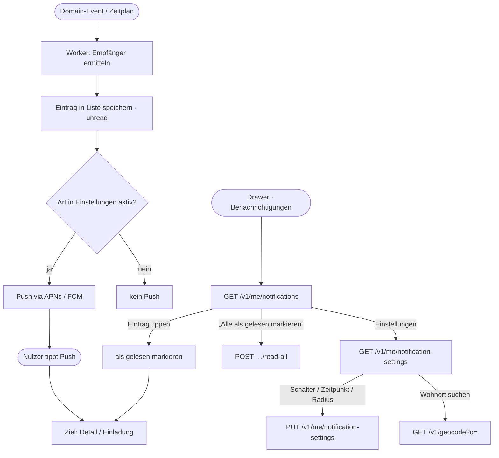

# 07 · Benachrichtigungen und Einstellungen

| | |
|---|---|
| **Ziel** | Nutzer über relevante Ereignisse informieren und jede Benachrichtigungsart einzeln steuerbar machen, inklusive Wohnort und Radius für neue Feste. |
| **Rollen** | Nutzer |
| **Moderationsansicht** | Nein. **Auslöser** kommen aber teilweise aus der Moderation: Veröffentlichen ([08](08-moderation-feste.md), [09](09-moderation-ki-suche.md)) löst „Neu an deinem Wohnort“ aus, Bearbeiten löst „Änderung“ aus, Absagen löst „Fest abgesagt“ aus. |
| **Einstieg** | „Benachrichtigungen“ im Drawer ([04](04-favoriten-und-zeitleiste.md)), Push-Nachricht, roter Punkt am Profilbild |
| **Weiter zu** | [02 Fest-Details](02-fest-details.md), [06 Einladungen](06-einladungen.md) |

## Screens

| Liste | Einstellungen | Wohnort und Radius | Hellmodus |
|---|---|---|---|
|  |  |  |  |

## Benachrichtigungsarten

| Art | Symbol | Auslöser (Backend) | Ziel beim Tippen | Einstellung | Modus |
|---|---|---|---|---|---|
| Erinnerung | ⏰ | Täglicher Job um 9:00: Favoriten, die in X Tagen beginnen (1, 3 oder 7) | Detailseite | `remind` + `remindDaysBefore` | async (Zeitplan) |
| Neu an deinem Wohnort | 📍 | `event.published`: Fest liegt im Radius um den Wohnort | Detailseite | `near` + `home` + `nearRadiusKm` | async (Event) |
| Änderung | ✏️ | `event.updated` an einem veröffentlichten Fest mit Änderungen an Datum, Zeiten oder Ort | Detailseite | `change` | async (Event) |
| Fest abgesagt | ⚠️ | `event.cancelled`: an alle mit diesem Favoriten und alle Zugesagten | Detailseite | `change` | async (Event) |
| Einladung | ✉️ | `invitation.created`, `invitation.reminded` | Erhaltene Einladung | `invite` | async (Event) |
| Zusage / Absage | 👍 / 👋 | `invitation.responded` | Zu-/Absage-Übersicht | `rsvp` | async (Event) |

**Wichtig:** Jede Benachrichtigung landet als Eintrag in der Liste. Die Einstellungen steuern nur, ob zusätzlich ein **Push** verschickt wird („Stumm geschaltete Arten erscheinen weiterhin in der Liste“).

## Ablauf

## Schritte

| # | Screen | Nutzeraktion | Frontend | Backend | Modus |
|---|---|---|---|---|---|
| 1 | 07-01 | Liste öffnen | Gruppen „Neu“ und „Früher“. Ungelesene fett mit rosa Punkt. | `GET /v1/me/notifications?cursor=` | sync |
| 2 | 07-01 | Eintrag tippen | Markiert als gelesen und öffnet das Ziel. | `POST /v1/me/notifications/{id}/read` | sync (optimistisch) |
| 3 | 07-01 | „Alle als gelesen markieren“ | Alle Punkte und Zähler verschwinden. | `POST /v1/me/notifications/read-all` | sync (optimistisch) |
| 4 | 07-02 | Einstellungen öffnen | Ein Schalter pro Art. | `GET /v1/me/notification-settings` | sync |
| 5 | 07-02 | Schalter umlegen | Sofort wirksam. | `PUT /v1/me/notification-settings` (ganzes Objekt, debounced) | sync (optimistisch) |
| 6 | 07-02 | Erinnerungszeitpunkt | „1 Tag vorher“, „3 Tage“ oder „1 Woche“. | wie Schritt 5 (`remindDaysBefore`) | sync |
| 7 | 07-03 | Wohnort eingeben | Vorschläge nach Stadt oder PLZ, ab 2 Zeichen. | `GET /v1/geocode?q=…&country=DE` | sync, debounced |
| 8 | 07-03 | „Aktuellen Standort verwenden“ | Nutzt die GPS-Position und zeigt den Ort per Reverse-Geocoding. | `GET /v1/geocode/reverse?lat=&lon=` | sync |
| 9 | 07-03 | Radius schieben | 5–150 km in 5er-Schritten. Die Vorschau „Aktuell n Feste im Umkreis …“ aktualisiert sich. | `GET /v1/events/count?lat=&lon=&radiusKm=` + Speichern wie Schritt 5 | sync |
| 10 | – | Push erhalten | Tipp öffnet das Ziel per Deep Link. | – | async |

## Regeln

- Der **Wohnort** ist unabhängig vom aktuellen Standort und wird nur für „Neu an deinem Wohnort“ genutzt.
- Standard: alle Arten aktiv, Erinnerung 1 Tag vorher, Radius 25 km, Wohnort leer. Ohne Wohnort ist „Neu an deinem Wohnort“ ausgegraut mit Hinweis (Annahme).
- **Änderungsmeldungen** werden pro Fest zusammengefasst (höchstens 1 Push pro Fest und Stunde).
- Zähler am Profilbild und im Drawer = Anzahl ungelesener Einträge. Er wird beim App-Start und beim Empfang eines Push aktualisiert.
- Die Systemberechtigung für Mitteilungen wird beim ersten Setzen eines Favoriten bzw. der ersten Einladung abgefragt, nicht beim App-Start.
