# 08 · Moderation: Feste

| | |
|---|---|
| **Ziel** | Moderatoren pflegen Feste in ganz Deutschland: anlegen, bearbeiten, als Entwurf speichern, veröffentlichen, absagen und löschen. |
| **Rollen** | Moderator (alle Feste; Regionen abgeschafft, [ADR 0015](../../25-adr/0015-regionen-abgeschafft.md)) |
| **Moderationsansicht** | **Ja.** Türkis statt Amber als Akzent, festes Banner „MODERATOR-ANSICHT · Name“ mit „Beenden“ und eine eigene Tab-Leiste „Feste / Kategorien“. |
| **Einstieg** | Profil-Drawer → „Moderator-Ansicht“ ([04](04-favoriten-und-zeitleiste.md)) |
| **Weiter zu** | [09 KI-Suche](09-moderation-ki-suche.md), [10 Kategorien](10-moderation-kategorien.md) |
| **Wirkt auf** | [01](01-stadtfest-suche.md) und [02](02-fest-details.md) (sichtbare Feste), [07](07-benachrichtigungen.md) (Benachrichtigungen) |

## Screens

| Feste | Bearbeiten: oben | Bearbeiten: Ort | Bearbeiten: Programm, Bilder |
|---|---|---|---|
|  | 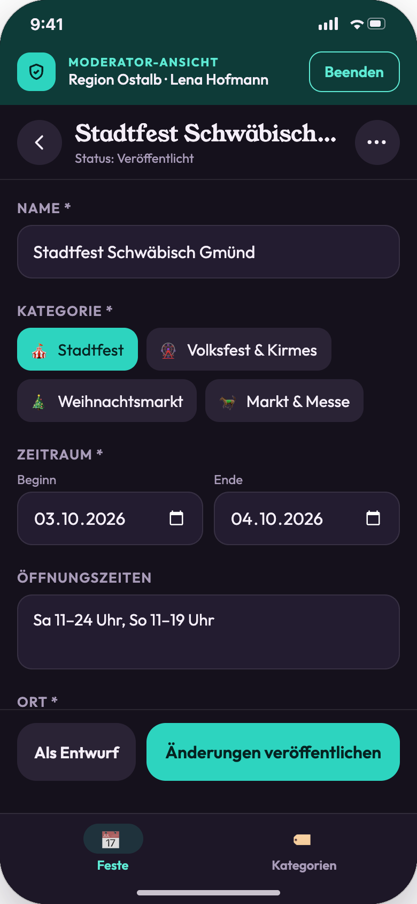 | 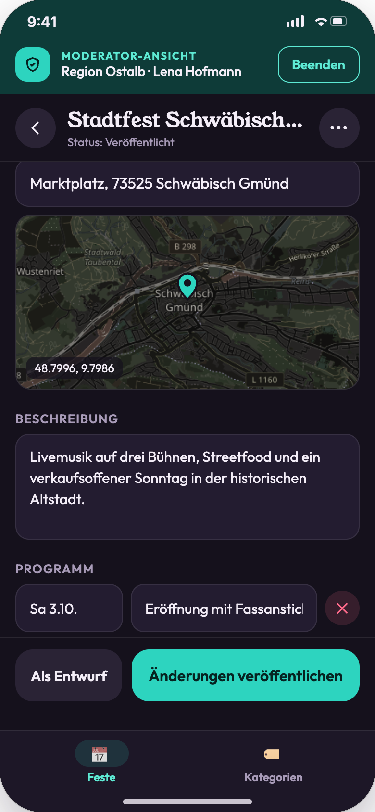 | 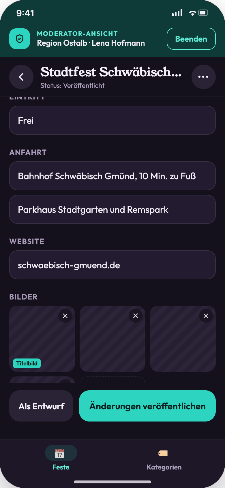 |
| **Neues Fest** | **Validierung** | **Ort per Pin** | **Menü ⋯** |
| 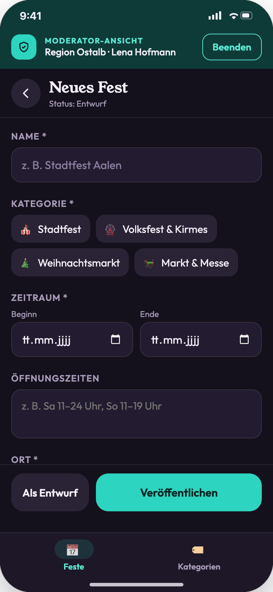 | 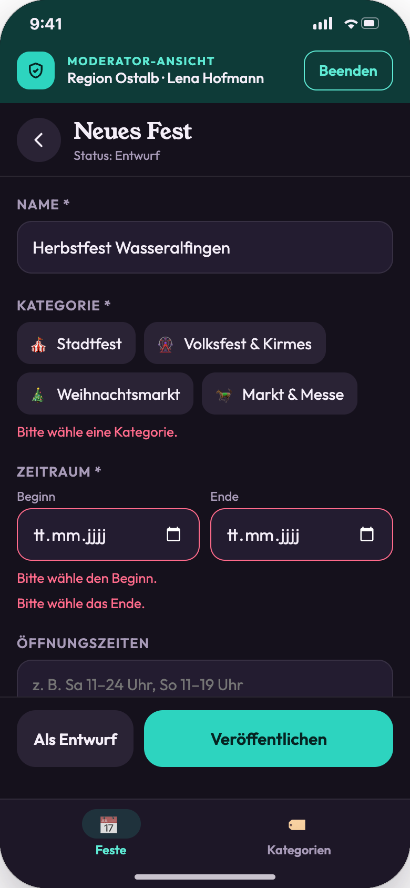 | 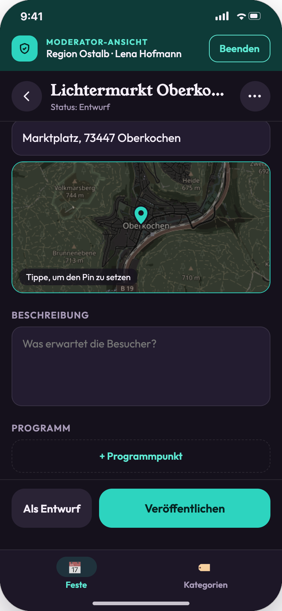 | 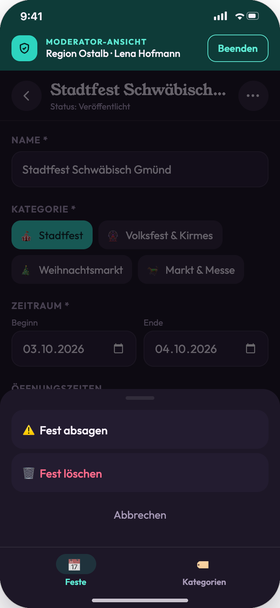 |
| **Absagen** | **Löschen** | **Hellmodus** | |
| 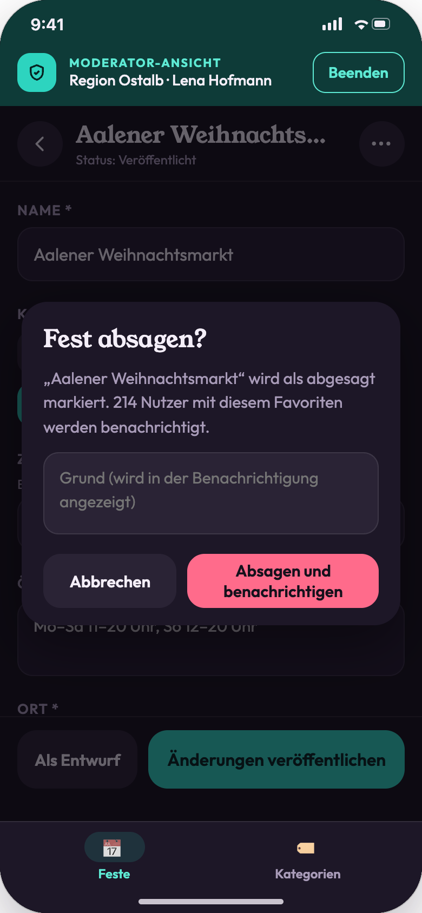 | 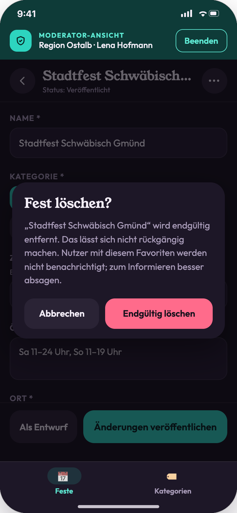 | 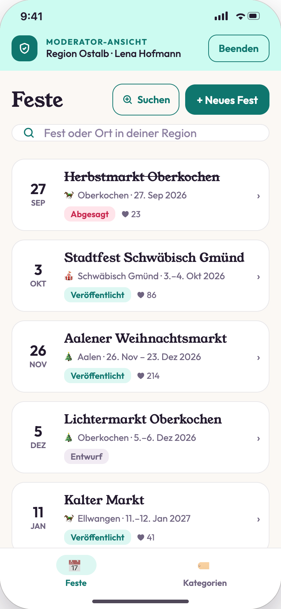 | |

## Statusmodell

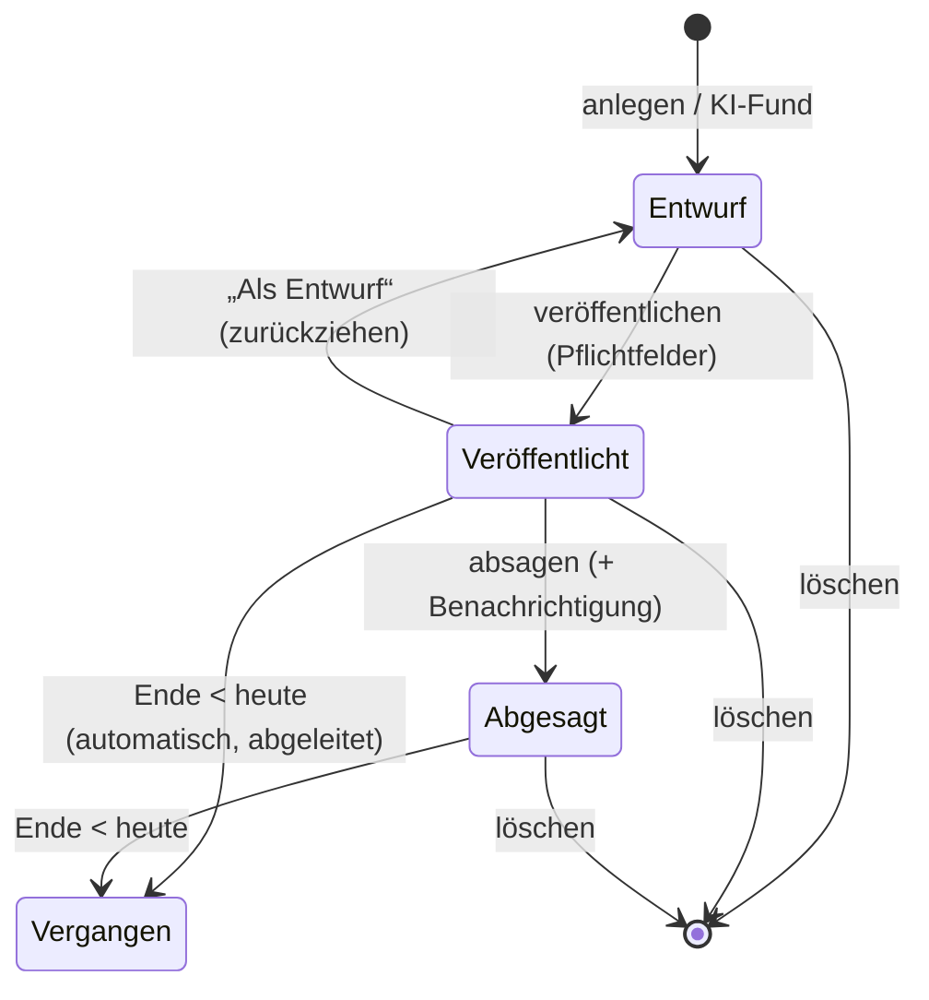

| Status | In der App sichtbar | Bearbeitbar |
|---|---|---|
| Entwurf | nein | ja |
| Veröffentlicht | ja | ja; Änderungen an Datum, Zeiten oder Ort lösen „Änderung“ aus |
| Abgesagt | ja, mit Status „Abgesagt“ | ja (nur Texte; Wiederaufnahme nicht vorgesehen) |
| Vergangen | nein in Karte und Liste, ja in Zeitleiste und Listen | ja (für Korrekturen) |

## Ablauf

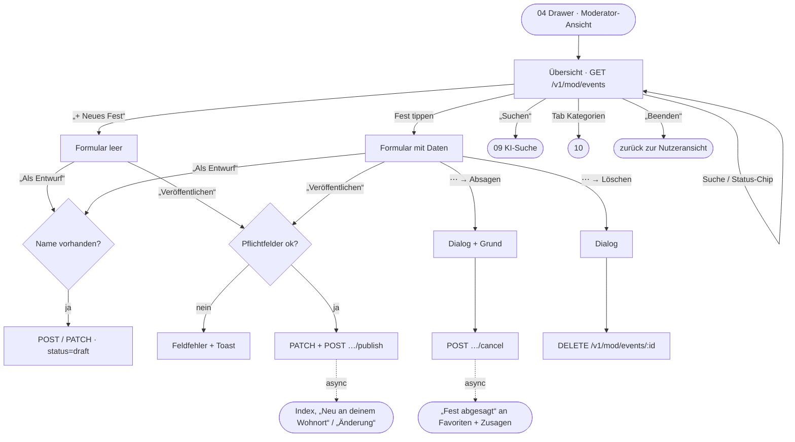

## Schritte

| # | Screen | Moderator-Aktion | Frontend | Backend | Modus |
|---|---|---|---|---|---|
| 1 | 08-01 | Moderator-Ansicht öffnen | Banner, Tab-Leiste, Skeleton. | `GET /v1/mod/events` (alle Status, inkl. `favoriteCount`) | sync |
| 2 | 08-01 | Suche / Status-Chip | Filtert Name und Ort. Chips mit Anzahl: Alle, Entwurf, Veröffentlicht, Vergangen, Abgesagt. | clientseitig oder `GET …?q=&status=` | lokal / sync |
| 3 | 08-05 | „+ Neues Fest“ | Leeres Formular mit Status „Entwurf“. | – | lokal |
| 4 | 08-02 | Fest öffnen | Formular mit allen Feldern, ⋯-Menü. | `GET /v1/mod/events/{id}` | sync |
| 5 | 08-03 | Ort: Adresse eingeben | Ab 3 Zeichen erscheinen bis zu 5 Vorschläge unter dem Feld („Suche Orte …“, „Kein Ort gefunden“). Ein Vorschlag setzt Adresse, PLZ, Ort und Pin; die Karte springt zum Ergebnis. | `GET /v1/geocode?q=&limit=5` | sync, debounced (300 ms) |
| 6 | 08-07 | Ort: „Pin auf Karte“ oder Tipp auf die Kartenvorschau | Vollbildkarte: verschieben und zoomen (+/−), der Pin bleibt in der Mitte, „Pin übernehmen“ setzt ihn. ✕ oder Android-Zurück verwerfen. Im Pin-Modus wird die Adresse **immer** aus dem Pin ermittelt (Straße, PLZ, Ort); ohne Straße in der Nähe stehen die Koordinaten als Adresse. | `GET /v1/mod/geocode/reverse?lat=&lon=` (nur Moderatoren, volle Genauigkeit) | sync |
| 7 | 08-04 | Programmpunkt hinzufügen/entfernen | Zeilen „Tag, Zeit“ und „Programmpunkt“. | – (wird mit dem Fest gespeichert) | lokal |
| 8 | 08-04 | „+ Hochladen“ | Auswahl aus der Mediathek. Die Kachel zeigt „Lädt hoch“, das erste Bild ist das Titelbild. | `POST /v1/mod/uploads` → signierte URL. Danach `PUT` der Datei direkt in den Speicher, dann `POST /v1/mod/events/{id}/images {uploadId}`. Thumbnails werden im Hintergrund erzeugt. | sync (Upload) + async (Thumbnails) |
| 9 | 08-04 | Bild entfernen (✕) | Entfernt die Kachel sofort. | `DELETE /v1/mod/events/{id}/images/{imageId}` | sync |
| 10 | 08-02 | „Als Entwurf“ | Pflicht ist nur der Name. Toast „Als Entwurf gespeichert“. War das Fest veröffentlicht, wird es zurückgezogen: „Zurück auf Entwurf gesetzt · für Nutzer ausgeblendet“. | `POST /v1/mod/events` (neu) bzw. `PATCH /v1/mod/events/{id}` + ggf. `POST …/unpublish` | sync |
| 11 | 08-06 | „Veröffentlichen“ mit Lücken | Rote Rahmen und Texte an den Feldern, Toast „Bitte fülle die markierten Pflichtfelder aus“. | – (Backend prüft zusätzlich: `422` mit Feldliste) | lokal / sync |
| 12 | 08-02 | „Veröffentlichen“ | Toast „Veröffentlicht · jetzt in der App sichtbar“ bzw. „Änderungen veröffentlicht“. | `PATCH …` + `POST /v1/mod/events/{id}/publish` | sync + async |
| 13 | 08-08 | ⋯ → „Fest absagen“ | Nur bei veröffentlichten Festen. Öffnet den Dialog. | – | lokal |
| 14 | 08-09 | „Absagen und benachrichtigen“ | Grund optional. Toast „Abgesagt · n Nutzer werden benachrichtigt“. | `POST /v1/mod/events/{id}/cancel {reason}` | sync + async (Fan-out) |
| 15 | 08-10 | ⋯ → „Fest löschen“ → „Endgültig löschen“ | Hinweis: Nutzer werden bei Löschung nicht benachrichtigt, Absagen ist die bessere Wahl. Toast „Fest gelöscht“. | `DELETE /v1/mod/events/{id}` (Soft-Delete; Favoriten, Listeneinträge und Einladungen werden entfernt) | sync + async (Aufräumen) |
| 16 | 08-01 | „Beenden“ | Zurück in die Nutzeransicht, Toast. Karte und Liste zeigen den neuen Stand. | `GET /v1/events` (neu laden) | sync |

## Asynchrone Folgen

| Auslöser | Event | Hintergrundarbeit |
|---|---|---|
| Veröffentlichen (erstmalig) | `event.published` | Suchindex aktualisieren. Nutzer finden, deren Wohnort im Radius liegt und die `near` aktiviert haben. Eintrag in der Liste und Push „Neu an deinem Wohnort“. |
| Änderungen veröffentlichen | `event.updated` | Bei Änderungen an Datum, Zeiten oder Ort: „Änderung“ an alle mit diesem Favoriten (`change`). |
| Absagen | `event.cancelled` | „Fest abgesagt“ mit Grund an alle mit diesem Favoriten und alle mit Zusage. Status in Zeitleisten und Listen aktualisieren. |
| Zurückziehen | `event.unpublished` | Aus dem Index entfernen, keine Benachrichtigung. |
| Löschen | `event.deleted` | Favoriten, Listeneinträge, Einladungen und Bilder entfernen. Keine Benachrichtigung. |

## Pflichtfelder und Validierung

| Feld | Entwurf | Veröffentlichen | Fehlertext |
|---|---|---|---|
| Name | ✓ | ✓ | „Bitte gib einen Namen ein.“ |
| Kategorie | – | ✓ (nur aktive) | „Bitte wähle eine Kategorie.“ |
| Beginn | – | ✓ | „Bitte wähle den Beginn.“ |
| Ende | – | ✓, ≥ Beginn | „Bitte wähle das Ende.“ / „Das Ende liegt vor dem Beginn.“ |
| Adresse oder Pin | – | ✓ | „Bitte gib eine Adresse ein oder setze einen Pin.“ |
| Öffnungszeiten, Beschreibung, Programm, Eintritt, Anfahrt, Website, Bilder | – | – | – |

## Stand der Umsetzung (R07)

- Die KI-Suche („Suchen“) folgt in R10, der Tab „Kategorien“ in R09; bis dahin zeigt der Tab einen Hinweis.
- Datumsfelder nutzen die Systemauswahl (`@react-native-community/datetimepicker`, Entscheidung 01.10.2026).
- Die Status-Chips der Übersicht zeigen die Anzahl je Status und filtern auf dem Gerät.
- „Als Entwurf“ bei einem veröffentlichten Fest speichert die Änderungen und zieht das Fest danach zurück (`PATCH` + `POST …/unpublish`).
- Abgesagte Feste lassen sich nur noch in Textfeldern ändern; der Button „Als Entwurf“ entfällt dort.
- Die Kartenvorschau im Formular nimmt keine Gesten an, damit sie nicht mit dem Scrollen kollidiert. Den Pin setzt die Vollbildkarte (`LocationPicker`, Entscheidung 01.10.2026 nach Gerätetest).
- Ein Adressvorschlag speichert nur Straße und Hausnummer als Adresse; PLZ und Ort stehen in eigenen Feldern. Die Detailseite (02) lässt doppelte Teile weg.
- Fest-Pins sind öffentliche Daten. Deshalb nutzt die Moderation einen eigenen Reverse-Endpunkt mit voller Genauigkeit und Straße; der öffentliche Endpunkt rundet weiter auf ~100 m (Nutzerpositionen, VVT Nr. 2).
- Android-Zurück schließt zuerst offene Ebenen (Tastatur, Dialog, ⋯-Menü, Vollbildkarte) und erst danach das Formular.
- Lokal liefert der Fake-Geocoder (`GEOCODING_PROVIDER=fake`) nur feste Orte rund um Aalen; er findet Wortanfänge in beliebiger Reihenfolge („Marktpl Aalen“, „Wasseralf“). Echte Adressen gibt es lokal nur mit Nominatim (`--profile geo`).
- Die Benachrichtigungen aus der Tabelle „Asynchrone Folgen“ kommen mit R11; die Events werden schon jetzt über die Outbox erzeugt.

## Regeln

- Die Übersicht ist sortiert: anstehende Feste aufsteigend, danach vergangene absteigend.
- Jede Zeile zeigt Status-Pill, ggf. „Automatisch gefunden“ ([09](09-moderation-ki-suche.md)) und „♥ Anzahl Favoriten“.
- **Ort:** Jeder Ort in Deutschland ist erlaubt; die frühere Regionsprüfung (`422 region_mismatch`) ist entfallen ([ADR 0015](../../25-adr/0015-regionen-abgeschafft.md)).
- **Gleichzeitiges Bearbeiten:** Optimistische Sperre über `version`. Bei `409` erscheint „Dieses Fest wurde inzwischen geändert“ mit der Möglichkeit, neu zu laden (Annahme).

## Stand der Umsetzung (R08)

- Bilder stehen im Formular unter „Website“ (08-04): Raster mit 3 Spalten, „Titelbild“ am ersten Bild, ✕ entfernt sofort, gestrichelte Kachel „+ Hochladen“ (bis 12 Bilder).
- Die Mediathek erlaubt Mehrfachauswahl. Die App verkleinert auf höchstens 2.560 px und speichert JPEG mit Qualität 0,85. Die Kacheln zeigen „Lädt hoch“, danach „Wird verarbeitet“. Die App fragt alle 2 s nach, bis das Bild fertig ist.
- **Titelbild ändern:** lange drücken → Menü „Als Titelbild“ / „Bild entfernen“ (Entscheidung 02.10.2026 statt Ziehen, das im Design fehlt).
- Fehlgeschlagene Bilder zeigen „Fehlgeschlagen · Erneut versuchen“.
- Bei einem neuen Fest speichert der erste Upload automatisch einen Entwurf. Ohne Namen erscheint der Hinweis, zuerst einen Namen einzugeben.
- Bildänderungen erhöhen nicht die `version` des Fests. Gleichzeitiges Bearbeiten der Felder bleibt davon unberührt.
- Die Katalog-Generation wird bei jeder Bildänderung erhöht, nicht nur beim Titelbild veröffentlichter Feste. Das ist einfacher und kostet nur einen zusätzlichen Cache-Neuaufbau.
