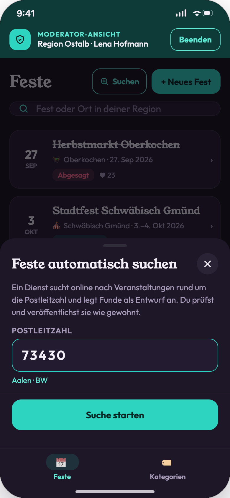
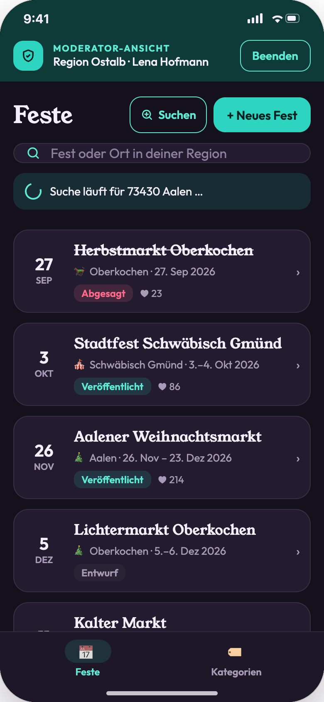
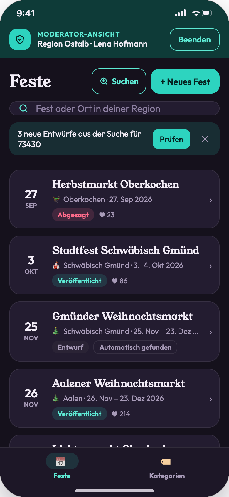
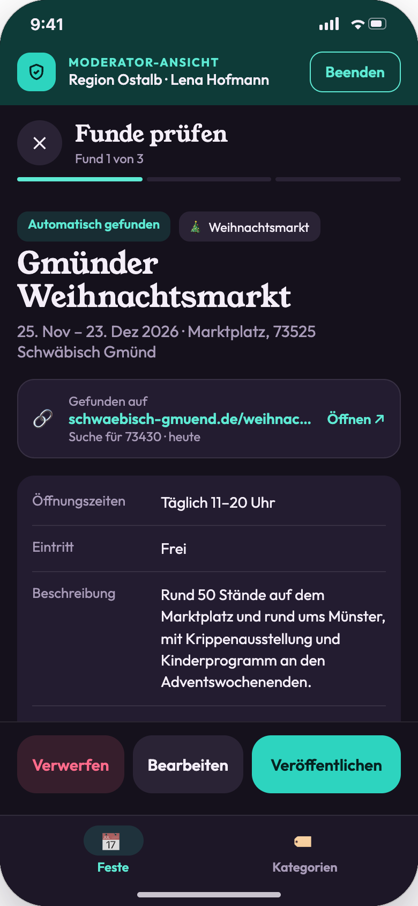
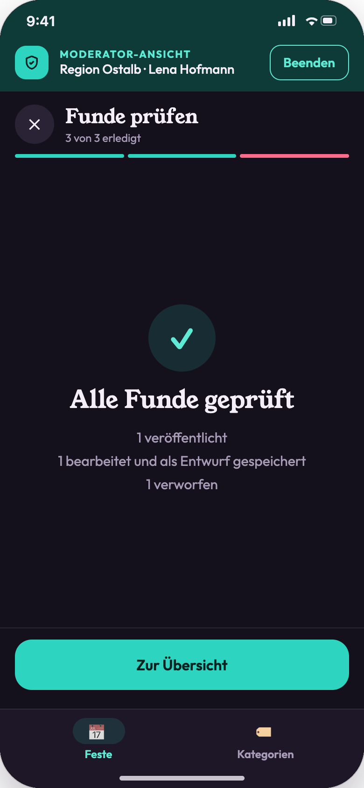
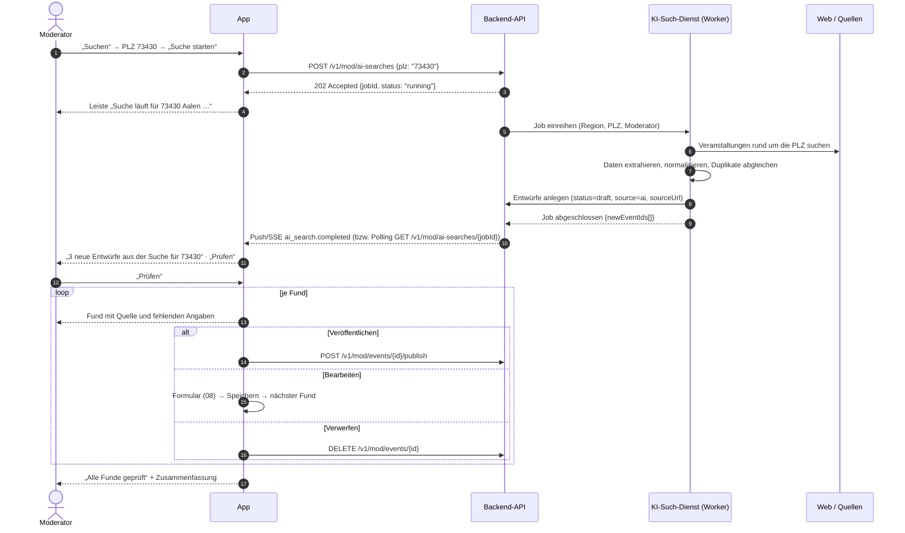

# 09 · Moderation: KI-Suche per PLZ

| | |
|---|---|
| **Ziel** | Ein Moderator stößt per Postleitzahl einen Backend-Dienst an, der mit KI online nach Veranstaltungen sucht und Funde als Entwurf anlegt. Anschließend prüft der Moderator die Funde. |
| **Rollen** | Moderator |
| **Moderationsansicht** | **Ja**, nur dort erreichbar. Nutzer sehen weder Button noch Funde, solange diese nicht veröffentlicht sind. |
| **Einstieg** | Übersicht der Feste ([08](08-moderation-feste.md)) → „Suchen“ |
| **Weiter zu** | [08 Fest bearbeiten](08-moderation-feste.md) |

## Screens

| PLZ eingeben | Suche läuft | Suche abgeschlossen | Funde prüfen | Alle geprüft |
|---|---|---|---|---|
|  |  |  |  |  |

## Abgrenzung Frontend / Backend

Das **Frontend** hat nur zwei Aufgaben: die PLZ übergeben und das Ergebnis anzeigen. Es gibt keine Quellenauswahl, keine Datei- oder Feed-Importe und keine Fortschrittsanzeige in Prozent. Suche, Extraktion, Abgleich mit vorhandenen Festen und das Anlegen der Entwürfe laufen vollständig im **Backend**.

## Ablauf

## Schritte

| # | Screen | Moderator-Aktion | Frontend | Backend | Modus |
|---|---|---|---|---|---|
| 1 | 09-01 | „Suchen“ | Sheet „Feste automatisch suchen“ mit PLZ-Feld. | – | lokal |
| 2 | 09-01 | PLZ eingeben | Nur Ziffern, genau 5. Bei bekannter PLZ steht der Ort darunter. „Suche starten“ ist erst bei gültiger Eingabe aktiv. | optional `GET /v1/geocode?q={plz}` für den Ortsnamen | sync |
| 3 | 09-02 | „Suche starten“ | Schließt das Sheet. Leiste mit Spinner: „Suche läuft für {PLZ} {Ort} …“. Die Übersicht bleibt bedienbar. | `POST /v1/mod/ai-searches {plz}` → `202 {jobId}` | **async** |
| 4 | 09-02 | (wartet oder arbeitet weiter) | Die Leiste bleibt sichtbar, auch nach „Beenden“ und erneutem Öffnen. | `GET /v1/mod/ai-searches?status=running` beim Öffnen; Abschluss per Push/SSE oder Polling alle 10 s | async |
| 5 | 09-03 | Suche abgeschlossen | Leiste „{n} neue Entwürfe aus der Suche für {PLZ}“ mit „Prüfen“ und ✕. Funde erscheinen als Entwurf mit der Pill „Automatisch gefunden“. Toast. | Ergebnis `{newEventIds[], updatedEventIds[], skipped}` | – |
| 6 | 09-03 | „Prüfen“ | Startet den Prüfmodus mit den Funden dieses Laufs. | `GET /v1/mod/events?ids=…` | sync |
| 7 | 09-04 | Fund ansehen | Bild bzw. „Kein Bild gefunden“, Name, Kategorie, Zeitraum, Adresse. Kasten „Gefunden auf {Quelle}“ mit Link. Fehlende Angaben in Rosa als „fehlt“. | – | lokal |
| 8 | 09-04 | „Veröffentlichen“ | Nur mit vollständigen Pflichtfeldern, sonst öffnet sich das Formular mit Hinweis. Weiter zum nächsten Fund. | `POST /v1/mod/events/{id}/publish` | sync + async (wie [08](08-moderation-feste.md)) |
| 9 | 09-04 | „Bearbeiten“ | Öffnet das Formular aus [08](08-moderation-feste.md). Nach dem Speichern geht es zum nächsten Fund. | `PATCH /v1/mod/events/{id}` | sync |
| 10 | 09-04 | „Verwerfen“ | Toast „Verworfen“, nächster Fund. | `DELETE /v1/mod/events/{id}` (merkt sich die Quelle, damit sie nicht erneut vorgeschlagen wird) | sync |
| 11 | 09-04 | ✕ (pausieren) | Toast „Pausiert · offene Funde bleiben als Entwurf“. Die Leiste mit „Prüfen“ bleibt. | – | lokal |
| 12 | 09-05 | „Zur Übersicht“ | Zusammenfassung: n veröffentlicht, n bearbeitet, n verworfen. Die Leiste verschwindet. | – | lokal |

## Backend-Dienst (Anforderungen)

| Punkt | Festlegung |
|---|---|
| Eingabe | `plz` (5 Ziffern). Region und Moderator ergeben sich aus dem Token. |
| Suchraum | Umkreis um die PLZ, begrenzt auf die Region des Moderators. Funde außerhalb werden übersprungen. |
| Ausgabe | Neue Feste immer als **Entwurf** mit `source = "ai"`, `sourceUrl`, `foundAt`, `aiJobId`. Nie direkt veröffentlicht. |
| Duplikate | Abgleich über Name, Zeitraum und Entfernung. Treffer werden übersprungen, **bestehende Feste werden nicht überschrieben** (Annahme). |
| Kategorie | Wird aus den aktiven Kategorien vorgeschlagen. Ohne sichere Zuordnung bleibt sie leer und muss beim Prüfen gesetzt werden. |
| Laufzeit | Sekunden bis Minuten. Job-Status `queued → running → completed / failed`. |
| Parallelität | Höchstens 1 laufender Job pro Moderator. Ein zweiter Start ergibt `409` mit dem laufenden Job. |
| Fehler | `failed` erzeugt die Leiste „Suche fehlgeschlagen · Erneut versuchen“ (Annahme, nicht gestaltet). |
| Protokoll | Suchanfragen, Quellen und Ergebnis pro Job speichern (Nachvollziehbarkeit). |

## Offene Punkte

- Sollen Updates an bestehenden Festen, z. B. geänderte Öffnungszeiten, als Änderungsvorschlag erscheinen? Aktuell werden sie übersprungen.
- Kosten und Rate-Limit für KI-Aufrufe pro Moderator bzw. Region.
- Bildrechte bei übernommenen Bildern aus Quellen: Vorerst werden nur Links gespeichert, keine Bilder übernommen (Empfehlung).
