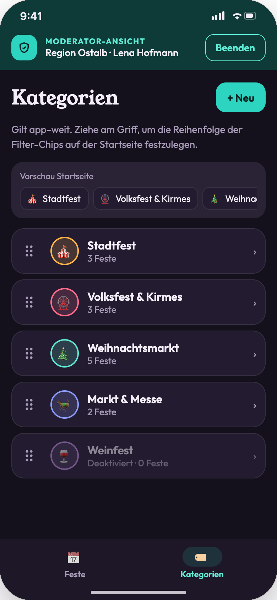
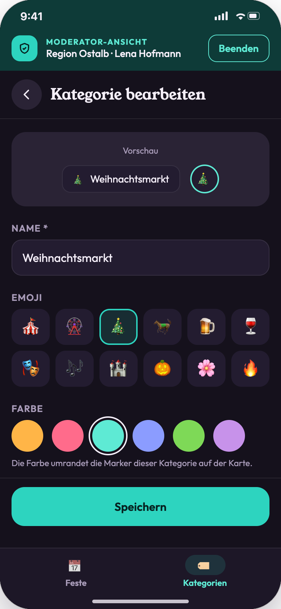
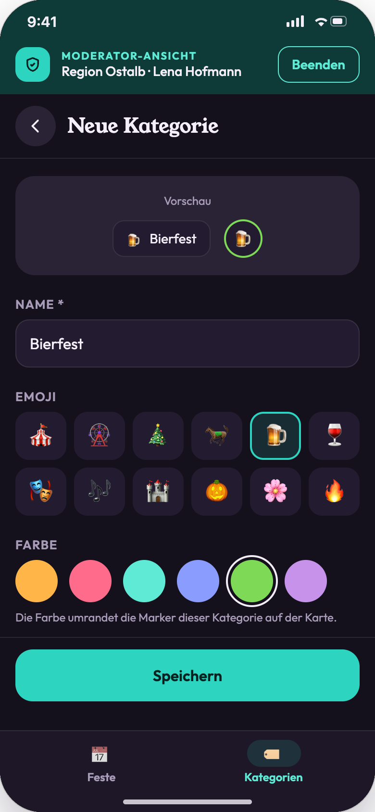
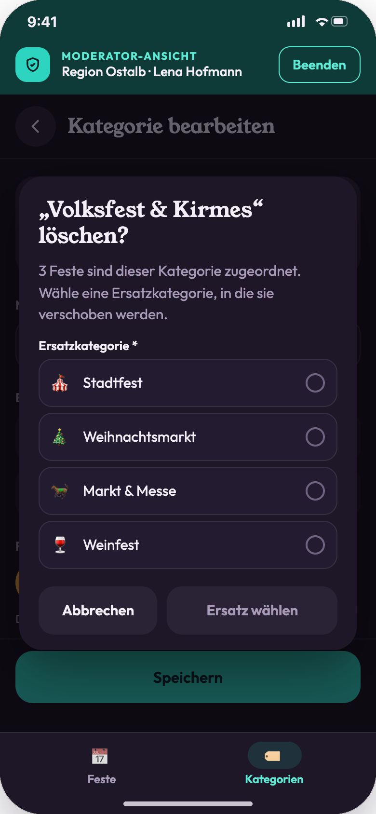
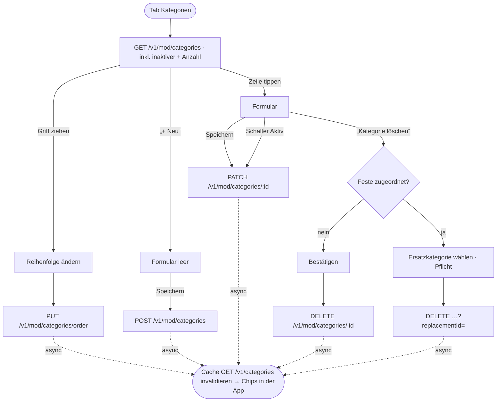

# 10 · Moderation: Kategorien

| | |
|---|---|
| **Ziel** | Kategorien pflegen, die app-weit als Filter-Chips und Marker-Farben erscheinen: anlegen, bearbeiten (Name, Emoji, Farbe), sortieren, deaktivieren, löschen. |
| **Rollen** | **Geklärt (E-06):** `category_admin` legt an, ändert, sortiert und löscht (app-weit, nicht auf die Region beschränkt). `moderator` ohne diese Rolle sieht den Tab nur lesend. |
| **Moderationsansicht** | **Ja**, Tab „Kategorien“ |
| **Einstieg** | Moderationsansicht → Tab „🏷️ Kategorien“ |
| **Wirkt auf** | [01 Stadtfest-Suche](01-stadtfest-suche.md): Reihenfolge und Sichtbarkeit der Chips, Filter-Sheet, Marker-Rand. [08](08-moderation-feste.md): Auswahl im Formular. |

## Screens

| Übersicht mit Drag & Drop | Kategorie bearbeiten | Neue Kategorie | Löschen mit Ersatzkategorie |
|---|---|---|---|
|  |  |  |  |

## Ablauf

## Schritte

| # | Screen | Moderator-Aktion | Frontend | Backend | Modus |
|---|---|---|---|---|---|
| 1 | 10-01 | Tab öffnen | Vorschau der Startseiten-Chips, Liste aller Kategorien mit Emoji, Farbe und „n Feste“. Deaktivierte halbtransparent mit „Deaktiviert · …“. | `GET /v1/mod/categories` | sync |
| 2 | 10-01 | Am Griff ziehen | Die Zeile hebt sich ab, die anderen rücken nach. Beim Loslassen: Toast „Reihenfolge gespeichert · Chips auf der Startseite aktualisiert“. | `PUT /v1/mod/categories/order {ids[]}` | sync (optimistisch) + async (Cache) |
| 3 | 10-03 | „+ Neu“ | Formular mit Vorschau von Chip und Marker. | – | lokal |
| 4 | 10-02 | Name, Emoji, Farbe ändern | Die Vorschau aktualisiert sich live. Emoji aus 12 Vorgaben, Farbe aus 6 Vorgaben. | – | lokal |
| 5 | 10-02 | Schalter „Aktiv“ | Deaktivierte Kategorien erscheinen nicht als Chip. Die zugeordneten Feste bleiben sichtbar. | wird mit Schritt 6 gespeichert (`active`) | – |
| 6 | 10-02 | „Speichern“ | Name ist Pflicht („Bitte gib einen Namen ein.“). Neue Kategorien landen am Ende der Reihenfolge. | `POST /v1/mod/categories` bzw. `PATCH /v1/mod/categories/{id}` | sync + async (Cache) |
| 7 | 10-04 | „Kategorie löschen“ ohne Feste | Einfache Bestätigung. | `DELETE /v1/mod/categories/{id}` | sync |
| 8 | 10-04 | „Kategorie löschen“ mit Festen | Ersatzkategorie ist Pflicht, bis dahin zeigt der Button „Ersatz wählen“. Danach: „Löschen und verschieben“. Toast „Gelöscht · n Feste nach ‚X‘ verschoben“. | `DELETE /v1/mod/categories/{id}?replacementId={id}`: Umzug und Löschen in einer Transaktion | sync + async (Index, Cache) |

## Regeln

- Kategorien gelten **app-weit** und sind nicht an eine Region gebunden.
- Die **Reihenfolge** (`sortOrder`) bestimmt die Reihenfolge der Chips auf der Startseite und im Filter-Sheet.
- **Farbe** = Rand der Karten-Marker und Rand des Emoji-Kreises. Werte aus der Palette in [theme-farben.md](../design/theme-farben.md).
- Die **Anzahl** zählt Feste aller Regionen und Status (außer gelöscht).
- Ist in einer Nutzer-Sitzung eine Kategorie als Filter gesetzt, die inzwischen deaktiviert oder gelöscht wurde, entfällt der Filter beim nächsten Laden stillschweigend.
- `GET /v1/categories` (öffentlich) ist mit `ETag` cachebar. Änderungen invalidieren den Cache, die App lädt beim nächsten Start bzw. nach 15 Minuten neu (Annahme).

## Stand der Umsetzung (R09)

- **Drag & Drop** ist eine eigene Lösung auf Reanimated 4 und Gesture Handler (`SortableList`, Entscheidung 02.10.2026), ohne zusätzliche Bibliothek. Man zieht am Griff; die Zeile hebt sich mit Schatten und türkisem Rand ab, die anderen rücken in 200 ms nach. Mit Screenreader verschieben die Aktionen „Nach oben/unten verschieben“ am Griff.
- Der Schalter **„Aktiv“** und **„Kategorie löschen“** stehen im Formular unter der Farbe (im Design 10-02 nicht sichtbar).
- **Nur-Lesen-Modus:** kein „+ Neu“, keine Griffe; das Formular zeigt den Hinweis „Nur Kategorie-Admins können Kategorien ändern.“ und hat weder Speichern noch Löschen.
- **Löschen:** Die angezeigte Anzahl zählt nur nicht gelöschte Feste. Verweisen nur gelöschte Feste auf die Kategorie, fordert der Dialog trotzdem eine Ersatzkategorie (die Datenbank verlangt bei veröffentlichten Festen eine Kategorie).
- **Cache:** Jede Änderung schreibt `category.changed` in die Outbox. Der Worker erhöht die Generation der Kategorien (neues `ETag`) und des Katalogs. Die App fragt `GET /v1/categories` mit `Cache-Control: no-cache` an, damit Androids HTTP-Cache die 15 Minuten aus `max-age=900` nicht selbst ausreizt. Beim Verlassen der Moderationsansicht lädt sie sofort neu, sonst spätestens nach 15 Minuten.
