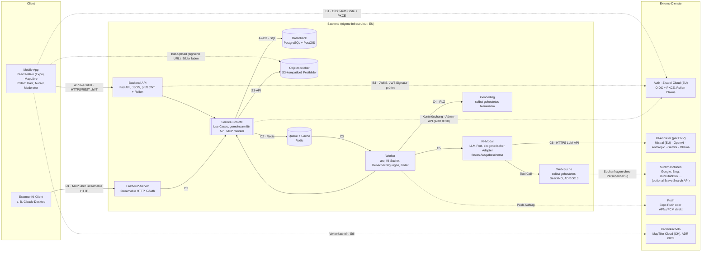

# Systemarchitektur

Markdown-Fassung von [`00-Design.pdf`](00-Design.pdf) (C4-Container-Ebene). Die Flows A–D stimmen mit dem Diagramm und mit CLAUDE.md „Core flows“ überein. Die Entscheidungen dazu stehen in [`25-adr/`](../25-adr/0001-adrs-verwenden.md).

**Betrieb:** Der Kern läuft auf einem eigenen Server in der EU. Externe Dienste sind per ENV austauschbar (DSGVO: Kern in der EU, Rest per ENV).

## Container



## Flows

| Flow | Schritte |
|---|---|
| **A · Suche als Gast** | A1 App → API ohne Token · A2 PostGIS-Umkreisabfrage → Ergebnisliste und Karte (Redis-Cache 5 min) |
| **B · Anmeldung** | B1 App ↔ Zitadel (OIDC, PKCE) → Token · B2 App sendet JWT an die API · B3 API prüft JWT per JWKS und liest Rollen aus den Claims. Kontolöschung: API löscht lokale Daten und den Nutzer über die Admin-API des IdP, bei Fehler per Worker-Retry (ADR 0010) |
| **C · KI-Suche per PLZ** | C1 Moderator stößt die Suche an, API legt einen Auftrag an (`202`) · C2 Auftrag in die Queue (über die Outbox, ADR 0005) · C3 Worker übernimmt · C4 Geocoding PLZ → Umkreis · C5 KI-Modul mit Festschema · C6 KI-Anbieter mit Web-Suche → validiertes JSON · C7 Speichern als **Entwurf** (Quelle geprüft, Duplikate und verworfene Quellen übersprungen) · C8 Moderator prüft und gibt frei; die App fragt den Status alle 10 s ab. LLM-Adapter: Pydantic AI (ADR 0012), Web-Suche: selbst gehostetes SearXNG (ADR 0013), Nicht-EU-LLM optional (ADR 0014) |
| **D · MCP** | D1 externer KI-Client → FastMCP (OAuth über Zitadel) · D2 Service-Schicht · D3 Datenbank |

## Ausgabeschema der KI-Suche (C5)

`name`, `date_from`, `date_to`, `place`, `address`, `coordinates`, `category`, `source_url`, `description`. Das Schema ist versioniert im Code und wird vor dem Speichern validiert. Ohne überprüfbare `source_url` wird ein Fund verworfen.

## Domain-Events über die Outbox (ab R07, ADR 0005)

```mermaid
flowchart LR
  UC[Use Case<br/>z. B. Fest veröffentlichen] -->|eine Transaktion| DB[(event + outbox)]
  DB -->|Relay im Worker<br/>jede Sekunde, SKIP LOCKED| Q[[arq-Queue · Redis]]
  Q --> H[handle_domain_event]
  H -->|alle Fest-Events| C[Katalog-Cache-Generation erhöhen]
  H -->|event.deleted| F[Favoriten des Fests entfernen]
  H -->|image.uploaded| I[Bild prüfen, Metadaten entfernen,<br/>Varianten in den Objektspeicher]
  H -->|image.removed| R[Bilddateien löschen]
  H -->|event.published (erstes Mal), event.updated, event.cancelled, ai_search.*| N[Benachrichtigungen: Einträge, Push-Jobs je 500 Empfänger]
```

- Jede Änderung eines Fests in der Moderation schreibt ihr Domain-Event (`event.published`, `event.updated` mit `changedFields`, `event.unpublished`, `event.cancelled`, `event.deleted`) **in derselben Transaktion** in die Tabelle `outbox`. Der Payload enthält nur IDs und Feldnamen.
- Das Relay läuft als Hintergrundschleife im Worker-Prozess, sperrt offene Einträge mit `FOR UPDATE SKIP LOCKED`, reiht sie mit der Event-ID als Job-ID in arq ein und markiert sie als versendet. Zustellung „at least once“; die Konsumenten sind idempotent.
- Versendete Einträge löscht ein täglicher Job nach 14 Tagen (03:30 Uhr).
- Ab R08 laufen auch Bild-Events über die Outbox (`image.uploaded`, `image.removed`, [ADR 0011](../25-adr/0011-bildauslieferung.md)). Die App lädt Fotos mit signierter URL direkt in den Objektspeicher und lädt Varianten direkt aus dessen öffentlichem Präfix `public/`. Ein täglicher Job (03:45 Uhr) räumt verwaiste Uploads und Bilder gelöschter Feste auf.

## Abbildung im Code

| Container | Einstiegspunkt | Paket |
|---|---|---|
| Backend-API | `uvicorn stadtfest.bootstrap.app:create_app --factory` | `adapters/inbound/rest` |
| Worker | `python -m stadtfest.bootstrap.worker` | `adapters/inbound/worker` |
| FastMCP-Server | ab R15 | `adapters/inbound/mcp` |
| Service-Schicht | – | `application/<context>` + `domain/<context>`; Kontexte `events`, `collections`, `ai_ingestion`, `moderation`, `notifications` (ADR 0016) |
| Datenbank, Objektspeicher, Redis, KI-Modul, Geocoding, Push | – | `adapters/outbound/<tech>` (hinter Ports) |

Lokal ersetzt Keycloak Zitadel (ADR 0003) und SeaweedFS den Objektspeicher (ADR 0007).
